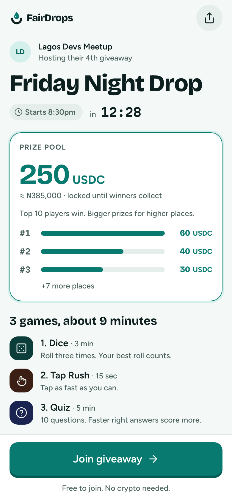
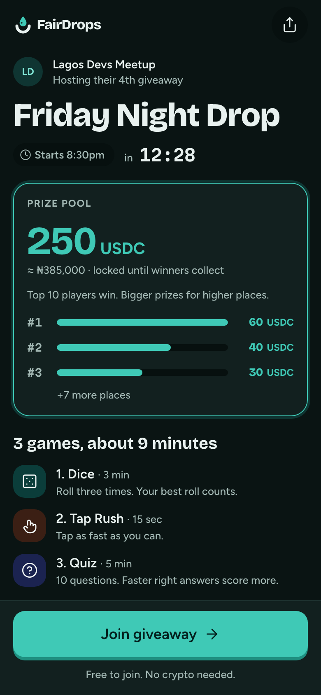

# Giveaway page

**Flow:** Player · mobile · **Route (proposed):** `/g/[chainId]/[giveawayId]`

Where a shared link lands. It sells the prize, explains the games and how fairness works, and has one action: Join.

| Light                                                 | Dark                                                |
| ----------------------------------------------------- | --------------------------------------------------- |
|  |  |

## Layout, top to bottom

- App bar: logo on the left, Share icon button on the right.
- Host row: avatar (initials), host name (`label`), "Hosting their 4th giveaway" (`caption`, muted).
- Title in `display-l`, balanced over two lines at most.
- StatusChip `upcoming` labelled "Starts 8:30pm", then Countdown `m` with label "in".
- Prize card, outlined in `lagoon` with a `lagoon-soft` ring:
  - overline "Prize pool";
  - PrizeAmount `xl` (250 USDC) with note "≈ ₦385,000 · locked until winners collect";
  - the line "Top 10 players win. Bigger prizes for higher places.";
  - a place list: the top 3 as rank, bar and amount, then "+7 more places".
- "3 games, about 9 minutes" (`title-m`), then one row per game in play order: a stage-coloured icon tile, "1. Dice · 3 min", and a one-line how-to.
- Avatar stack with "1,204 joined".
- FairBadge `pending` beside: "Scores are recorded by the game server and checked by independent checkers before anyone is paid. You can check it yourself afterwards."
- Sticky bar: Button `lg` block "Join giveaway →", with the note "Free to join. No crypto needed."

## States

- **Loading:** skeleton blocks in `surface-sunken` for the title, prize card and game rows.
- **Joined:** the sticky button becomes secondary "✓ You're in"; once the lobby opens, it becomes "Go to lobby".
- **Live** (phase `live`): the chip becomes `live` and the button "Join now" while joining is still allowed. Otherwise the button is disabled with "Joining closed" and the page shows a live board preview.
- **Settling / claimable / closed:** the top of the page shows results. Use the results layout without the prize sheet if the viewer did not take part.
- **Cancelled:** chip `cancelled` and "The host cancelled this giveaway. The prize went back to them." There is no action.
- **Invalid** (phase `invalid`): a 404-style message, "This giveaway can't be shown."

## Data

- `fd.giveaways.get(chainId, giveawayId)` → `GiveawayView` (title, host, `tokenInfo`, prize, `rewards` split, `phase`, `session`).
- `fd.sessions.byGiveaway(chainId, giveawayId)` → games and start time.
- `fd.sessions.participants(sessionId)` → joined count and avatars.
- Place amounts come from the `rewards` policy (`rewardPlaces` in `@fairdrops/shared`).

## Navigation

- Join giveaway → the Join sheet if signed out, otherwise join (`fd.sessions.join`) and go to the Lobby.
- Share → the native share sheet with the giveaway URL.
