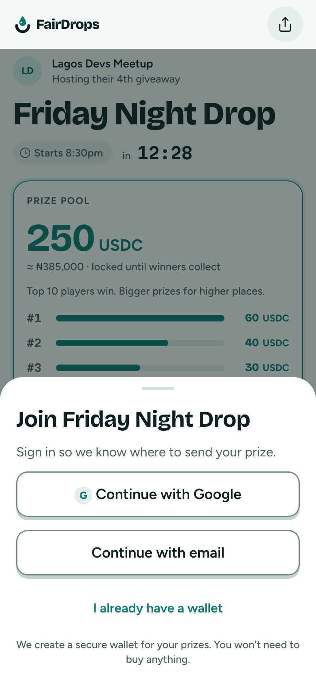
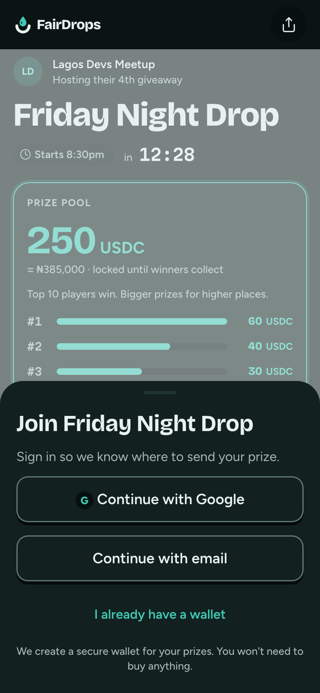

# Join sheet

**Flow:** Player · mobile · **Route (proposed):** `sheet over /g/[chainId]/[giveawayId]`

Sign in without crypto words. A wallet is created quietly to receive the prize.

| Light                                            | Dark                                           |
| ------------------------------------------------ | ---------------------------------------------- |
|  |  |

## Layout, top to bottom

- The giveaway page dimmed underneath, with an `ink` scrim at 50%.
- Bottom sheet (`radius-xl` top corners, `lift`) with a grab handle.
- Title "Join Friday Night Drop" (`title-l`), then "Sign in so we know where to send your prize."
- Buttons, all `lg` and block: secondary "Continue with Google", secondary "Continue with email", ghost "I already have a wallet".
- Footnote (`caption`, centred): "We create a secure wallet for your prizes. You won't need to buy anything."

## States

- **Busy:** the tapped button shows `loading`; the others are disabled.
- **Error:** a danger-soft banner inside the sheet, for example "Google sign-in was cancelled. Try again or use email."
- **Success:** the sheet closes, the player joins, and the app goes to the Lobby.

## Data

- `fd.auth.signIn(signer)` (Sign-In with Ethereum) using a Web3Auth embedded wallet, or the connected wallet for the third option. See [Open questions](../DESIGN.md#open-questions).
- Then `fd.sessions.join(sessionId)`.

## Navigation

- Success → Lobby.
- Swipe down or tap the scrim → close.
