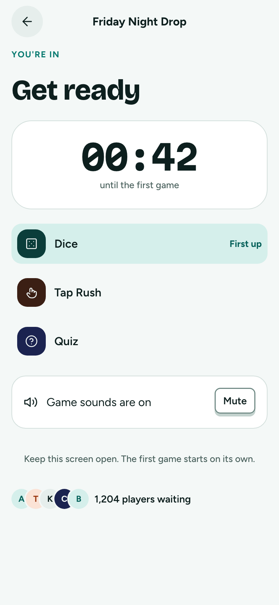
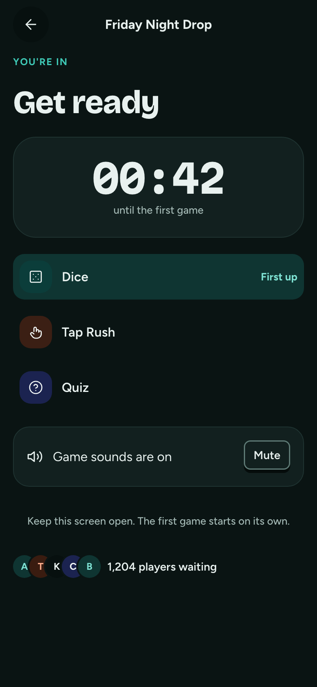

# Lobby

**Flow:** Player · mobile · **Route (proposed):** `/play/[sessionId]`

Keeps players on the page until the first game. It shows the countdown, the line-up and a sound check.

| Light                                      | Dark                                     |
| ------------------------------------------ | ---------------------------------------- |
|  |  |

## Layout, top to bottom

- App bar: back, then the giveaway title.
- Overline "You're in" in `lagoon`, then "Get ready" in `display-l`.
- Timer card: Countdown `l` and "until the first game". It turns flare in the last 5 seconds.
- Game line-up in order. The first row is tinted `lagoon-soft` and tagged "First up".
- Sound card: "Game sounds are on" with a Mute button.
- "Keep this screen open. The first game starts on its own." and the waiting player count.

## States

- **Reconnecting:** a small top banner "Reconnecting…" while `LiveConnection.state` is `reconnecting`. The countdown keeps running on server time.
- **Start:** at 0, go straight to the first game stage. There is no button.

## Data

- `LiveConnection.connect(fd)`, then `live.subscribe(sessionId)`. Room `status` moves through `SCHEDULED`/`SEED_COMMITTED`/`LOBBY` to `RUNNING`.
- Countdown from the session start time minus `live.now()`.

## Navigation

- Room status `RUNNING` → the first game.
