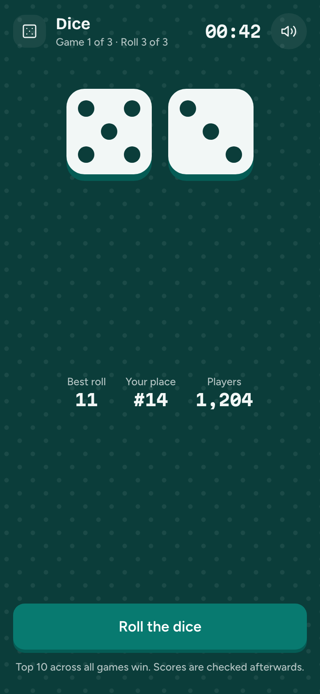
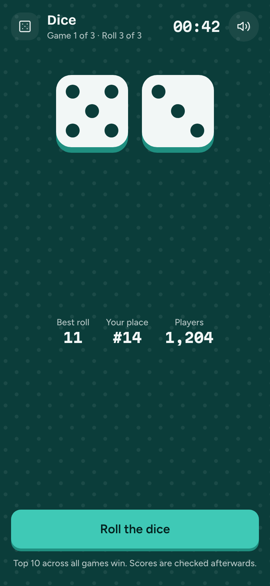

# Game 1 · Dice

**Flow:** Player · mobile · **Route (proposed):** `/play/[sessionId] (stage: dice)`

The Dice game. The whole screen takes the Dice stage ground.

| Light                                             | Dark                                            |
| ------------------------------------------------- | ----------------------------------------------- |
|  |  |

## Layout, top to bottom

- GameStage `dice` at full bleed (no radius). The header has the icon, "Dice", "Game 1 of 3 · Roll 2 of 3", Countdown `m` and the sound toggle.
- Two dice: 104px `on-stage` tiles with `stage-dice` pips and a `lagoon-press` edge. They shake while rolling.
- Stats row in `on-stage-muted` captions: Best roll, Your place ("#14"), Players.
- Bottom: Button `lg` block "Roll the dice" (loading "Rolling" while rolling). After 3 rolls it becomes secondary "Done · next game".
- The note "Top 10 across all games win. Scores are checked afterwards."

## States

- **Rolling:** the dice shake, the button is busy, and there is a tick sound per face change.
- **Out of rolls:** the button is secondary.
- **Time up:** the stage fades toward the next game.

## Data

- `room.act({ type: "roll" })` → `ActionResult`; the dice come from `room.playerView` (server-decided, seeded).
- Live place from `room.publicView`.

## Navigation

- Game over (room public view) → Next game.

## Notes

- The dice values always come from the server. The local animation just runs until the result arrives.
