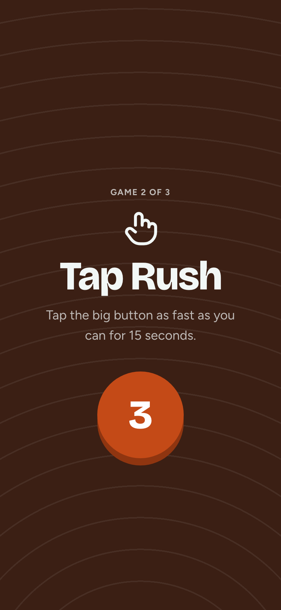
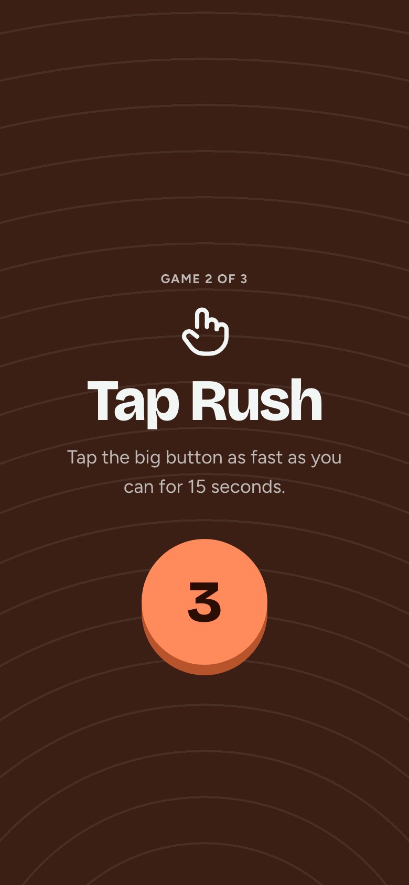

# Next game

**Flow:** Player · mobile · **Route (proposed):** `/play/[sessionId] (between games)`

Makes the switch between games obvious. The ground changes to the next game's stage colour, with a 3-2-1 count.

| Light                                         | Dark                                        |
| --------------------------------------------- | ------------------------------------------- |
|  |  |

## Layout, top to bottom

- Full screen on the next game's stage ground (`stage-tap` here), with that game's pattern.
- Overline "Game 2 of 3", the game icon at 56px, the game name in `display-xl`, and a one-line how-to (`body-l`, muted).
- A 120px flare disc counting 3 → 2 → 1 → Go, with an `ease-spring` pop and a blip sound per step.

## States

- The screen always auto-advances. There is no button.

## Data

- Driven by the room's public view: the current game index and its start time.

## Navigation

- After "Go" → that game's stage.
