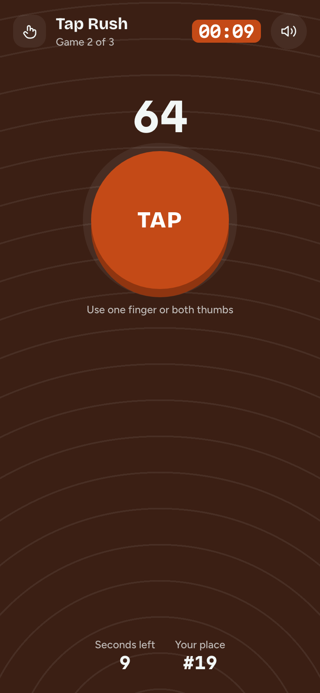
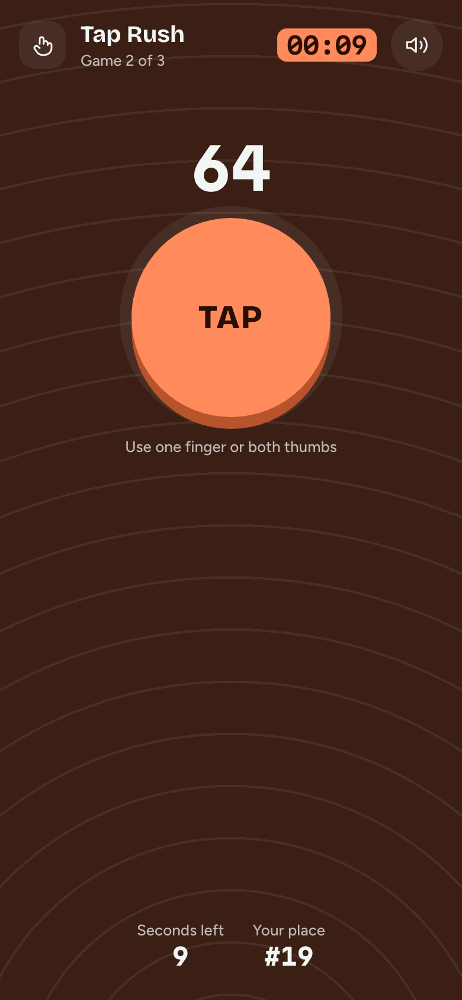

# Game 2 · Tap Rush

**Flow:** Player · mobile · **Route (proposed):** `/play/[sessionId] (stage: tap)`

The speed game. Tap as fast as possible for 15 seconds.

| Light                                                | Dark                                               |
| ---------------------------------------------------- | -------------------------------------------------- |
|  |  |

## Layout, top to bottom

- GameStage `tap` at full bleed. The header has "Tap Rush", "Game 2 of 3", the countdown and the sound toggle.
- TapTarget in the lower-middle, within thumb reach: the count above it (Martian Mono 48) and the 168px flare key with a 10px press edge.
- The hint "Use one finger or both thumbs".
- Stats: seconds left and your place.

## States

- **Time!** The key is disabled and the hint reads "Time! Saving your score…".

## Data

- Each tap: `room.act({ type: "tap" })`. The SDK rate-limits to the gateway's `MAX_ACTIONS_PER_SECOND`, and the server's count is the score.

## Navigation

- Last game over → Counting results.
