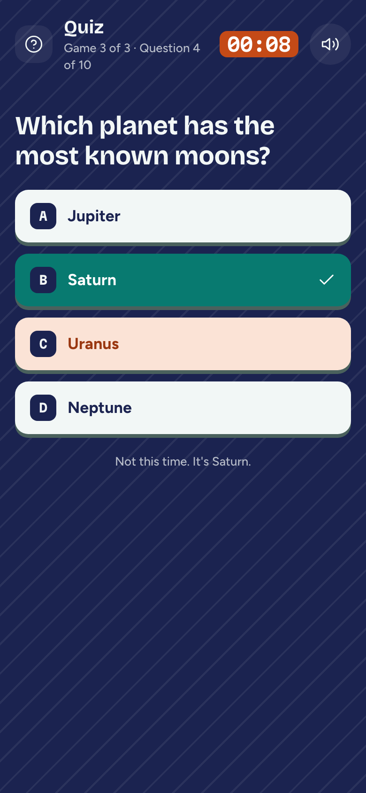
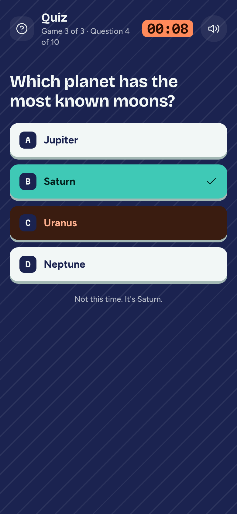

# Game 3 · Quiz

**Flow:** Player · mobile · **Route (proposed):** `/play/[sessionId] (stage: quiz)`

The quiz game. Faster right answers score more.

| Light                                             | Dark                                            |
| ------------------------------------------------- | ----------------------------------------------- |
|  |  |

## Layout, top to bottom

- GameStage `quiz` at full bleed. The header shows "Game 3 of 3 · Question 4 of 10" and an 8-second countdown.
- The question in `title-l`, balanced.
- Four answer tiles: `on-stage` fill, a key chip A–D, and an `ink-muted` press edge.
- A feedback line below.

## States

- **Picked:** the tile turns `flare-soft`.
- **Revealed:** the right tile turns `lagoon` with a check icon. The feedback reads "Right! +340" or "Not this time. It's Saturn." Never rely on colour alone.

## Data

- `room.act({ type: "answer", choice })`; the question comes from `room.publicView`.

## Navigation

- After the last question → Counting results.
