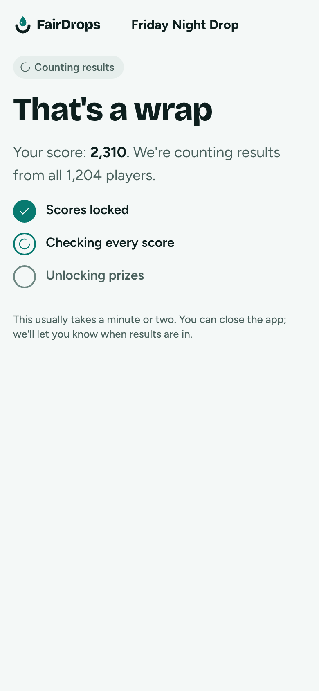
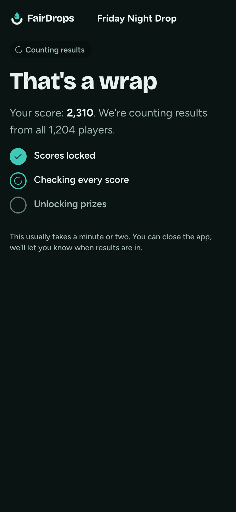

# Counting results

**Flow:** Player · mobile · **Route (proposed):** `/play/[sessionId]/results`

Settlement in player words while the worker builds, signs and submits the result.

| Light                                                    | Dark                                                   |
| -------------------------------------------------------- | ------------------------------------------------------ |
|  |  |

## Layout, top to bottom

- StatusChip `settling`, then "That's a wrap" in `display-l`.
- "Your score: 2,310. We're counting results from all 1,204 players."
- Three steps with dots (done: `lagoon` check; now: spinner): "Scores locked", "Checking every score", "Unlocking prizes".
- "This usually takes a minute or two. You can close the app; we'll let you know when results are in."

## States

- Steps map to the settlement: session `SETTLING` = step 1; settlement `PROPOSED`/`SIGNED` = step 2; `SUBMITTED` = step 3; session `FINALIZED` → Results.
- **Failed** (session `FAILED` or phase `expired`): chip `failed`, and "This game couldn't produce a result, so nobody was paid and the host gets the prize back."

## Data

- The room's `status` events, and `fd.settlement.get(sessionId)` for the settlement status.

## Navigation

- `FINALIZED` → Results.
