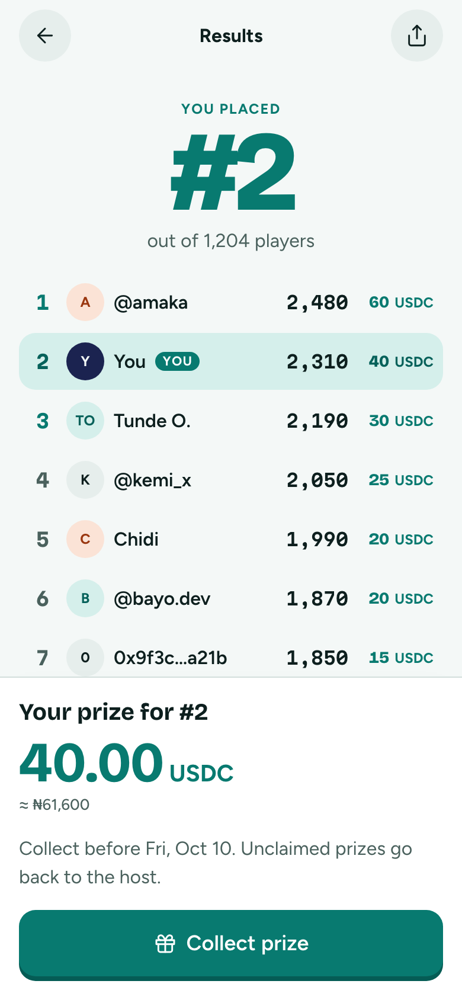
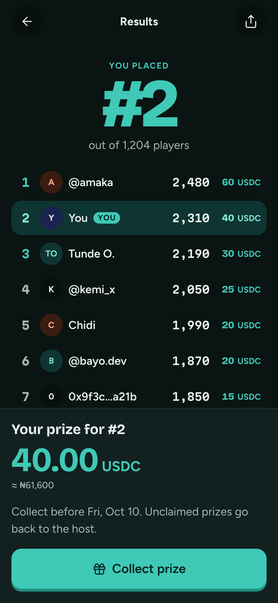

# Results

**Flow:** Player · mobile · **Route (proposed):** `/play/[sessionId]/results`

The one orchestrated moment: your place, the board rising in, then your prize.

| Light                                          | Dark                                         |
| ---------------------------------------------- | -------------------------------------------- |
|  |  |

## Layout, top to bottom

- App bar: back, "Results", share.
- Hero: overline "You placed", the rank in Bricolage 800 at 96px `lagoon`, and "out of 1,204 players". It pops in over `duration-reveal`, with confetti in lagoon, flare and quiz ink, and the win sound.
- Leaderboard: LeaderboardRow rows rising in 80ms apart. The viewer's row is tinted and tagged "You".
- FairBadge `verified` "by 3 checkers", which opens How we checked.
- Sticky bottom: ClaimCard (see the note on the relayer).

## States

- **Won, relayer on (default):** ClaimCard goes `collecting` → `collected` on its own. There is no button.
- **Won, self-claim:** ClaimCard `ready` with "Collect prize".
- **Didn't win:** ClaimCard `none`: "You finished #14. Winners were the top 10."
- **Window over, not collected:** ClaimCard `expired`.

## Data

- The ranking from the room's `status` message (`ranking`) or `fd.sessions.get`.
- The payout from `fd.claims.get(chainId, giveawayId, account)` → `ClaimView` (`amount`, `claimable`, `claimedAt`, `claimDeadline`).

## Navigation

- Collect prize → Collecting.
- FairBadge → How we checked.

## Notes

- See [Open questions](../DESIGN.md#open-questions) #1: the prototype shows the self-claim path.
