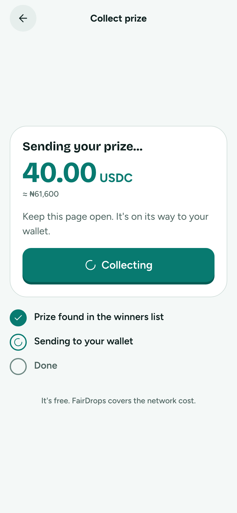
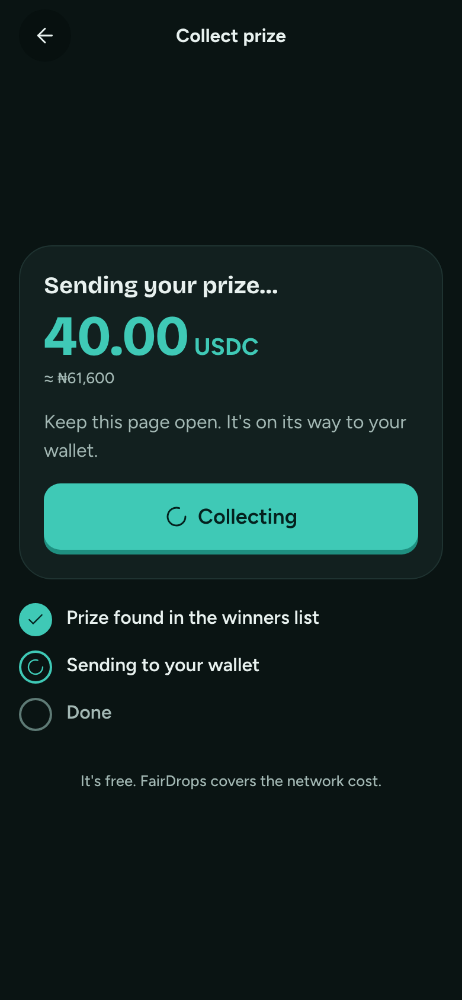

# Collecting

**Flow:** Player · mobile · **Route (proposed):** `/play/[sessionId]/results`

The prize on its way, with a busy state that can't be double-tapped.

| Light                                                | Dark                                               |
| ---------------------------------------------------- | -------------------------------------------------- |
|  |  |

## Layout, top to bottom

- ClaimCard `collecting`: the amount and a busy "Collecting" button.
- Steps: "Prize found in the winners list" ✓, "Sending to your wallet" (spinner), "Done".
- "It's free. FairDrops covers the network cost."

## States

- **Error:** a danger-soft banner, "We couldn't send it yet. Your prize is safe; we'll retry automatically.", with a Try again button for self-claim.

## Data

- Self-claim: `claimPrize(walletClient, claim)` → tx hash; then poll `isClaimed` or `fd.claims.get` until `claimedAt` is set.
- Relayed: poll `fd.claims.get` until `claimedAt` is set.

## Navigation

- `claimedAt` set → Collected.
