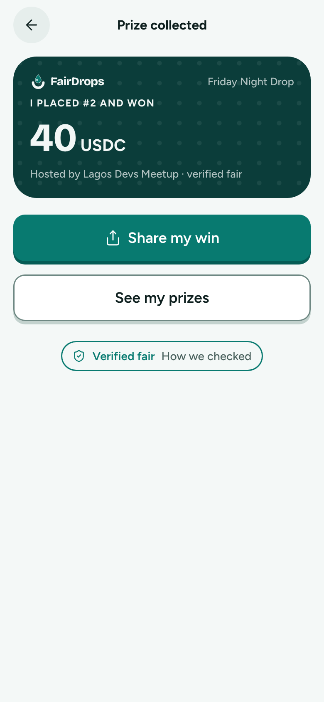
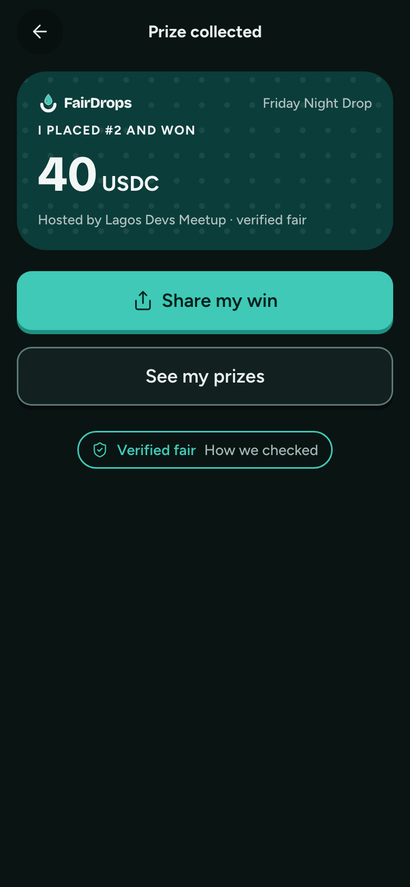

# Collected

**Flow:** Player · mobile · **Route (proposed):** `/play/[sessionId]/results`

Celebrate and share. The proof is one tap away.

| Light                                              | Dark                                             |
| -------------------------------------------------- | ------------------------------------------------ |
|  |  |

## Layout, top to bottom

- Win card on the `stage-dice` ground with the dot pattern: logo, giveaway name, "I placed #2 and won", the amount in `xl`, and "Hosted by … · verified fair". This is the shareable image.
- Buttons: primary "Share my win", secondary "See my prizes".
- FairBadge `verified` "How we checked".

## Data

- `ClaimView.claimTx` for the receipt link (only on the verify screen).

## Navigation

- Share my win → the share sheet with a generated image (OG image route).
- See my prizes → My prizes.
- FairBadge → How we checked.
