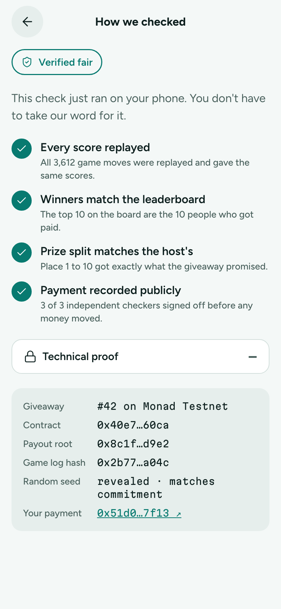
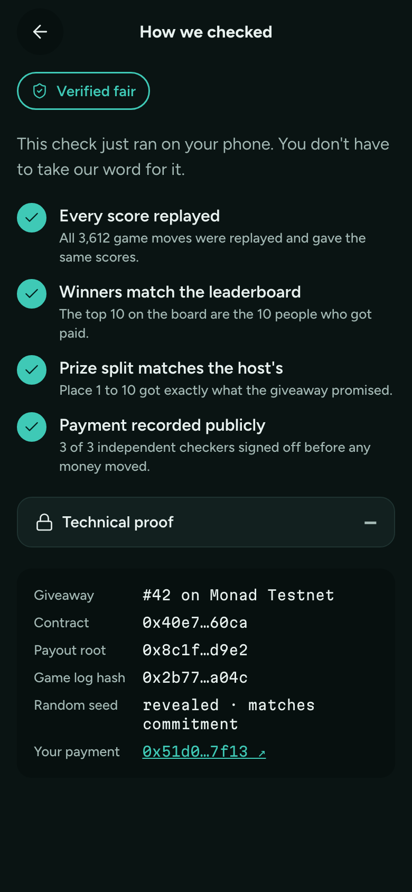

# How we checked

**Flow:** Player · mobile · **Route (proposed):** `/g/[chainId]/[giveawayId]/verify`

Runs the verification in the player's browser and explains it in plain words.

| Light                                                | Dark                                               |
| ---------------------------------------------------- | -------------------------------------------------- |
|  |  |

## Layout, top to bottom

- FairBadge: `checking` while running, then `verified`.
- "This check just ran on your phone. You don't have to take our word for it."
- Four checks, each ticking in turn, as a bold title plus a caption:
  1. **Every score replayed:** "All 3,612 game moves were replayed and gave the same scores."
  2. **Winners match the leaderboard:** "The top 10 on the board are the 10 people who got paid."
  3. **Prize split matches the host's:** "Place 1 to 10 got exactly what the giveaway promised."
  4. **Payment recorded publicly:** "3 of 3 independent checkers signed off before any money moved."
- A collapsed "Technical proof" disclosure: a `mono-s` list of giveaway id and chain, contract, payout root, game log hash, random seed (revealed and matching its commitment), and your payment tx as a link to the explorer.

## States

- **Failed check:** FairBadge `failed`. The failing check shows a danger icon and explains what didn't match, with a link to the raw report.

## Data

- `verifyGiveaway(fd, chainId, giveawayId)` from `@fairdrops/sdk/verify` → `GiveawayVerification` (per-check results: transcript, giveaway, game, seed, result, transcriptHash, payouts).

## Navigation

- Back → wherever it was opened from.
