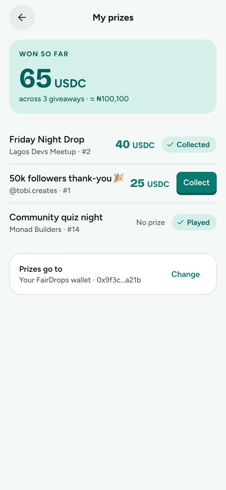
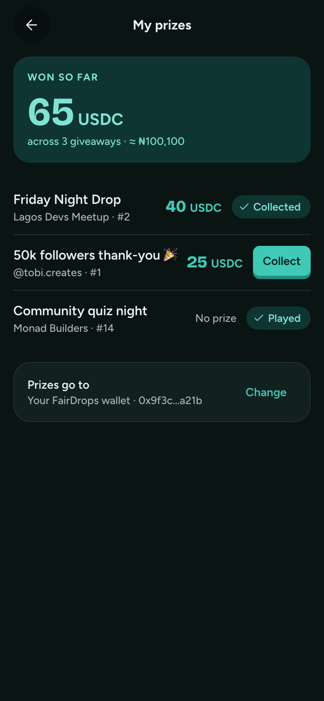

# My prizes

**Flow:** Player · mobile · **Route (proposed):** `/me/prizes`

Everything you've won, what's left to collect, and where prizes go.

| Light                                           | Dark                                          |
| ----------------------------------------------- | --------------------------------------------- |
|  |  |

## Layout, top to bottom

- Total card (`lagoon-soft`): "Won so far", 65 USDC `xl`, "across 3 giveaways · ≈ ₦100,100".
- A list row per giveaway played: title and "host · #place", the amount (or "No prize"), then a StatusChip `claimed` / `results` ("Played") or a small "Collect" button.
- The row "Prizes go to · Your FairDrops wallet · 0x9f3c…a21b" with a ghost Change button.

## States

- **Empty:** "No prizes yet. Find a giveaway to play." and a button to Discover.
- **Mixed tokens:** show one total per token; never add different tokens together.

## Data

- `fd.claims.mine()` → `ClaimView[]`.
- Change payout wallet: `setPayoutWallet` in `@fairdrops/sdk/claims`.

## Navigation

- Row → that giveaway's results.
- Collect → Collecting.
