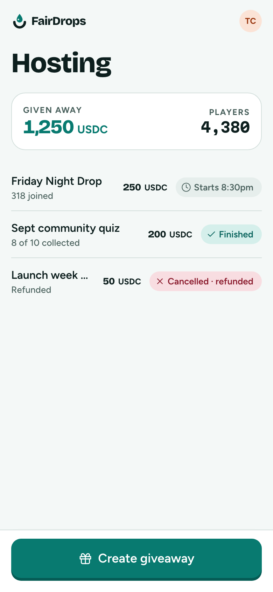
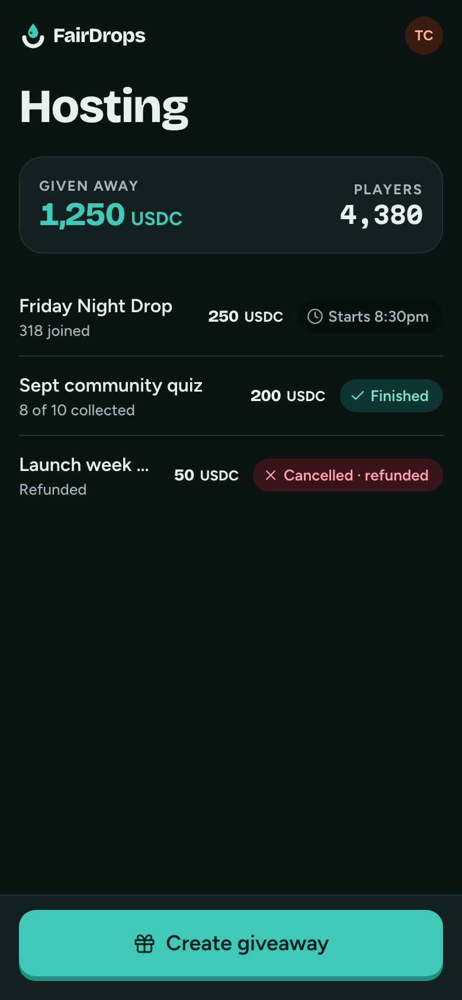

# Hosting home

**Flow:** Host · mobile · **Route (proposed):** `/host`

A host's giveaways and totals. The main action is always Create.

| Light                                              | Dark                                             |
| -------------------------------------------------- | ------------------------------------------------ |
|  |  |

## Layout, top to bottom

- Title "Hosting" (`display-l`).
- Totals card: "Given away" 1,250 USDC and "Players" 4,380.
- A list row per giveaway: title, a status line ("318 joined", "8 of 10 collected", "Refunded"), the amount (muted) and a StatusChip.
- Sticky: Button `lg` "Create giveaway".

## States

- **Empty (first-time host):** a short pitch, "Lock a prize, share a link, let people play for it.", and the Create button.

## Data

- `fd.giveaways.list({ host: me })` (`GiveawayListParams`).

## Navigation

- Create giveaway → Who's it for?
- Row → Manage.
