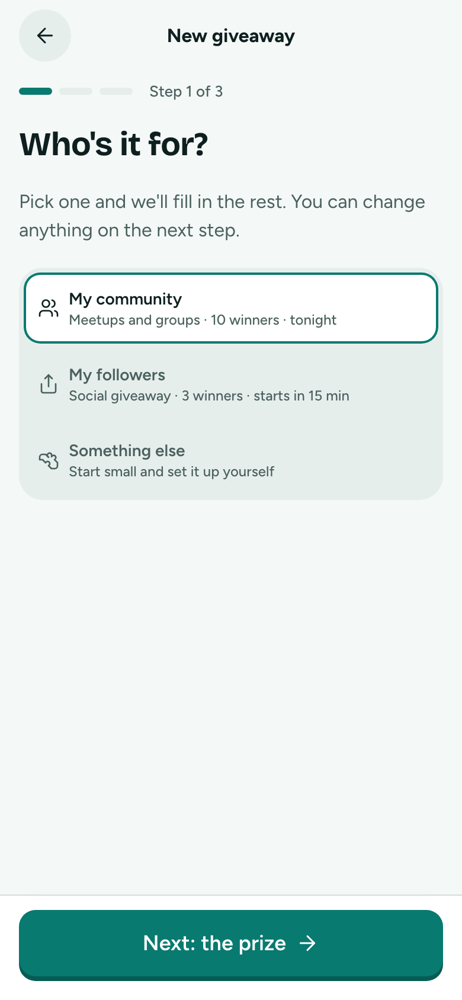
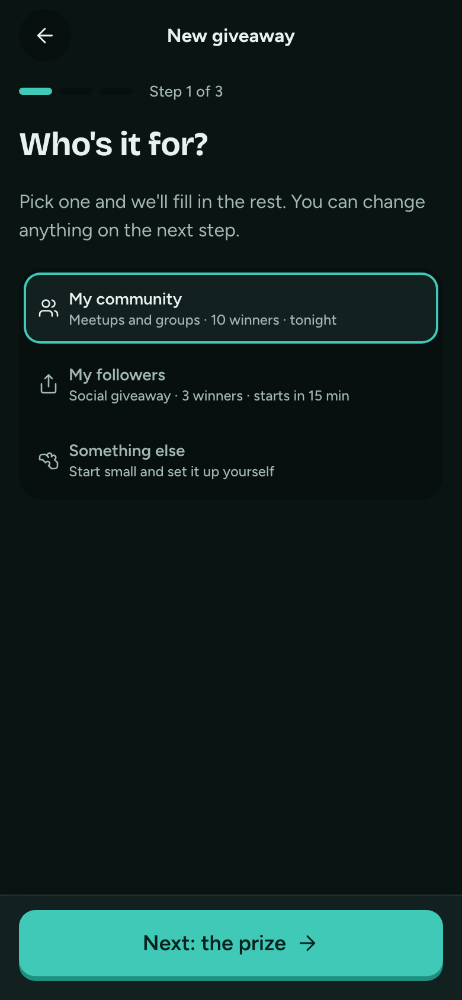

# Create 1 · Who's it for?

**Flow:** Host · mobile · **Route (proposed):** `/host/new`

One tap picks a preset that fills in every default.

| Light                                                              | Dark                                                             |
| ------------------------------------------------------------------ | ---------------------------------------------------------------- |
|  |  |

## Layout, top to bottom

- App bar "New giveaway", then a 3-step progress bar showing "Step 1 of 3".
- "Who's it for?" (`title-l`), then "Pick one and we'll fill in the rest. You can change anything on the next step."
- Segmented `stacked` with three presets:
  - **My community:** "Meetups and groups · 10 winners · tonight";
  - **My followers:** "Social giveaway · 3 winners · starts in 15 min";
  - **Something else:** "Start small and set it up yourself".
- Sticky: "Next: the prize →".

## Data

- The presets are client-side defaults (winners, split, games, start, pool) and are expected to change often. Keep them in one config file.

## Navigation

- Next → The prize.
