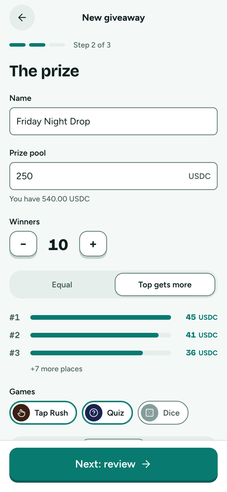
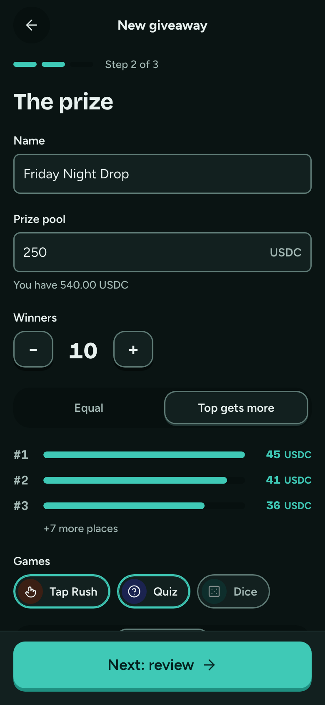

# Create 2 · The prize

**Flow:** Host · mobile · **Route (proposed):** `/host/new`

Everything editable on one screen. The split preview updates as you type.

| Light                                                       | Dark                                                      |
| ----------------------------------------------------------- | --------------------------------------------------------- |
|  |  |

## Layout, top to bottom

- Field "Name", prefilled.
- Field "Prize pool": decimal input, `USDC` suffix, hint "You have 540.00 USDC". A token picker comes later.
- Winners stepper: − / count / +, 1 to 50.
- Segmented split: "Equal" / "Top gets more" (the `equal` / `weighted` reward policy).
- Place preview: the top 3 as bars with amounts, then "+N more places".
- Game chips (toggle, stage-coloured icon): Tap Rush, Quiz, Dice.
- Segmented start: "In 15 min" / "Tonight 8:30" / "Pick time" (which opens a date-time sheet).
- Sticky: "Next: review →", disabled while invalid.

## States

- **Errors** (inline, on the field):
  - "That's more than you have (540.00 USDC)";
  - "Pick at least 1 winner";
  - "Start must be at least 2 minutes from now";
  - the game window must be between 10 minutes and 30 days (contract limits).

## Data

- `prepareGiveaway(input)` from `@fairdrops/sdk/host` validates and builds the metadata; `InvalidGiveawayError` messages map to the field errors.
- Token balance from the connected wallet.

## Navigation

- Next → Review and lock.
