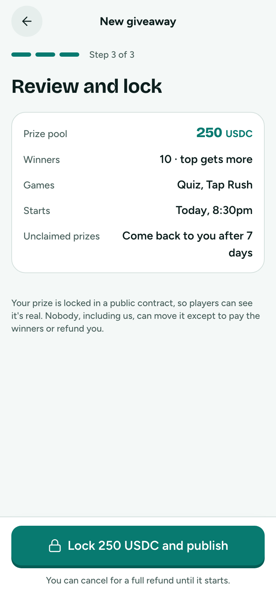
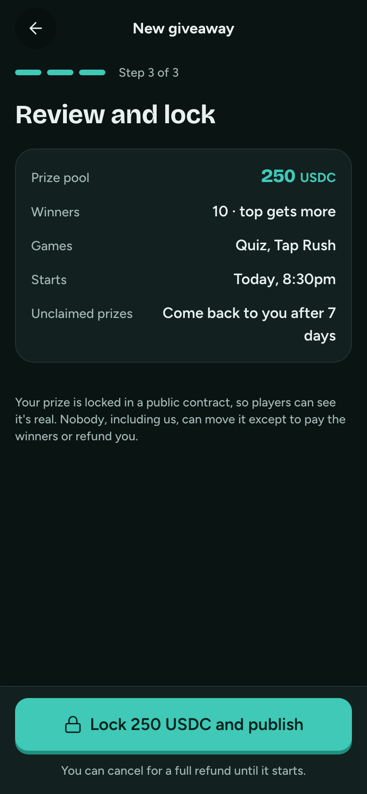

# Create 3 · Review and lock

**Flow:** Host · mobile · **Route (proposed):** `/host/new`

A plain summary, then approve and lock in two wallet steps.

| Light                                                              | Dark                                                             |
| ------------------------------------------------------------------ | ---------------------------------------------------------------- |
|  |  |

## Layout, top to bottom

- A summary card, as a definition list: Prize pool · Winners and split · Games · Starts · "Unclaimed prizes: come back to you after 7 days".
- Trust note: "Your prize is locked in a public contract, so players can see it's real. Nobody, including us, can move it except to pay the winners or refund you."
- Sticky: Button `lg` with a lock icon, "Lock 250 USDC and publish", and the note "You can cancel for a full refund until it starts."

## States

- **Locking:** two steps appear: "Allow FairDrops to use 250 USDC" (the ERC-20 approve) and "Lock the prize and publish" (create). The button is busy and the note reads "Confirm in your wallet when asked."
- **Wallet rejected:** "You cancelled in your wallet. Nothing was locked." and the button is back.
- **Failed:** show what went wrong, and that nothing was taken if it failed before the lock.

## Data

- `createGiveaway(wallet, prepared)` from `@fairdrops/sdk/host` (approve, then create).

## Navigation

- Success → Published.
