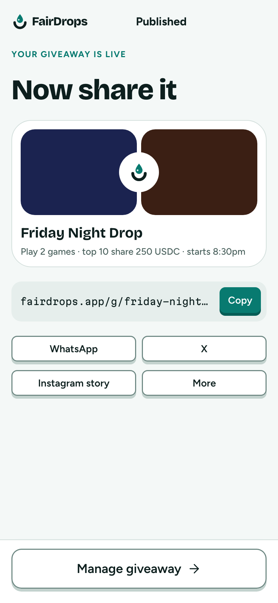
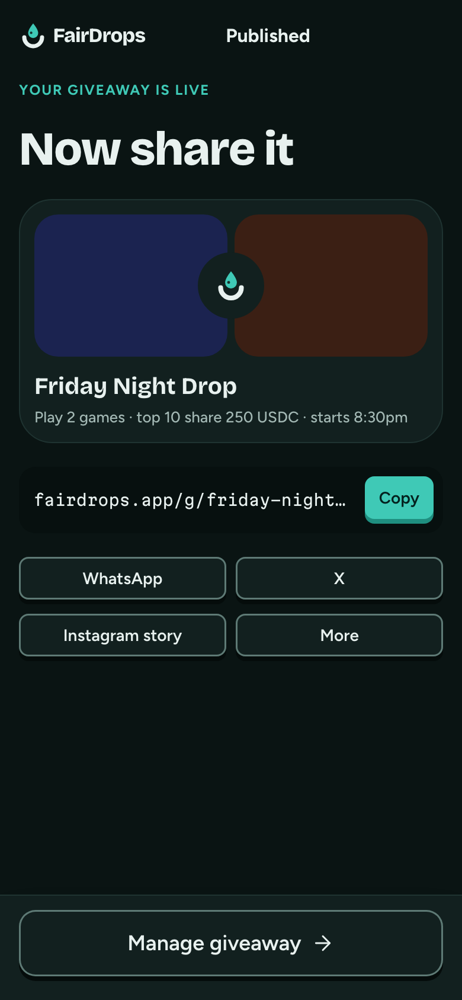

# Published

**Flow:** Host · mobile · **Route (proposed):** `/host/[chainId]/[giveawayId]/share`

Share straight away.

| Light                                           | Dark                                          |
| ----------------------------------------------- | --------------------------------------------- |
|  |  |

## Layout, top to bottom

- Overline "Your giveaway is live", then "Now share it" (`display-l`). Confetti.
- Share card preview: the game stage colours as blocks with the mark, the title, and "Play 2 games · top 10 share 250 USDC · starts 8:30pm".
- Copy field: `fairdrops.app/g/…` in `mono-s` and a Copy button (→ "✓ Copied").
- A 2×2 grid of share buttons: WhatsApp, X, Instagram story, More (native share).
- Sticky: secondary "Manage giveaway →".

## Data

- An OG image route renders the share card for link previews.

## Navigation

- Manage giveaway → Manage.
