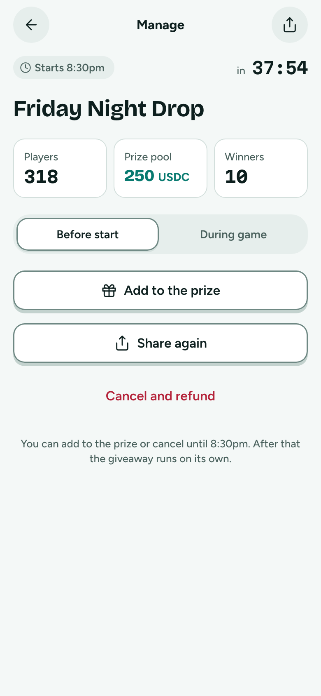
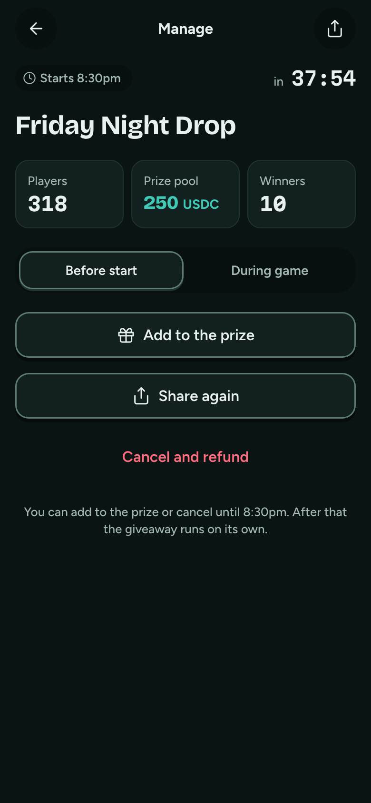

# Manage

**Flow:** Host · mobile · **Route (proposed):** `/host/[chainId]/[giveawayId]`

Before the start: add to the prize, share or cancel. During the game: watch the live board. After: withdraw leftovers.

| Light                                          | Dark                                         |
| ---------------------------------------------- | -------------------------------------------- |
|  |  |

## Layout, top to bottom

- Chip and countdown row, then the title.
- Three stat tiles: Players · Prize pool · Winners.
- Before the start: secondary "Add to the prize", secondary "Share again", danger ghost "Cancel and refund", and "You can add to the prize or cancel until 8:30pm. After that the giveaway runs on its own."
- During the game: "Live leaderboard" with the top 5 rows.

## States

- **After finalization:** collected count ("8 of 10 collected"). After the claim deadline, a primary "Withdraw 40 USDC".
- **Cancel:** a confirmation sheet ("Cancel Friday Night Drop? 250 USDC comes back to your wallet. Players will see it was cancelled.") with a danger button.

## Data

- `addFunds` (only before start), `cancelGiveaway`, `withdrawable` and `withdraw` from `@fairdrops/sdk/host`.
- Live board via `LiveConnection` in spectate mode.
