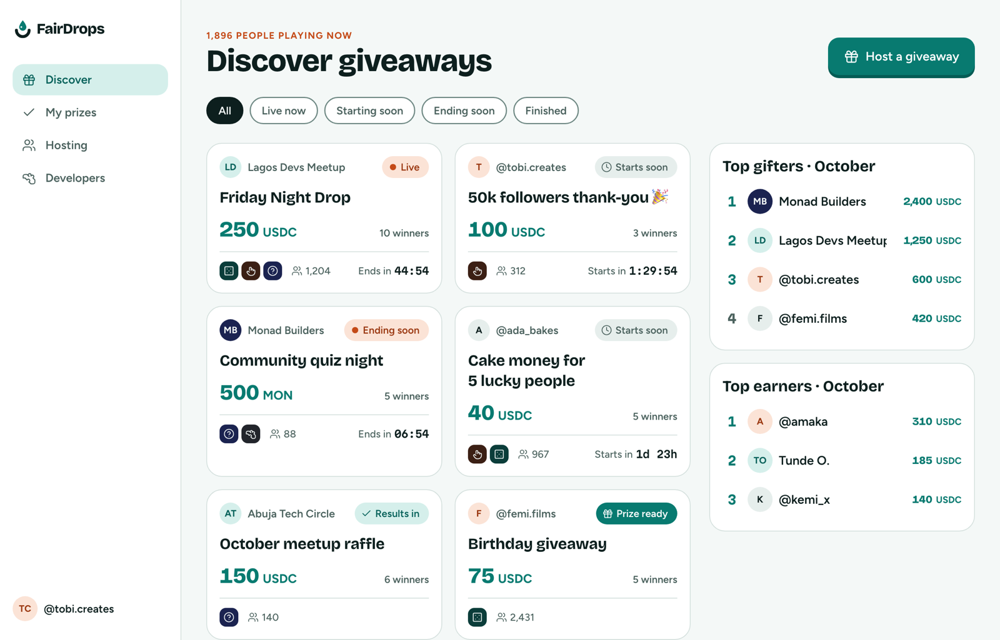
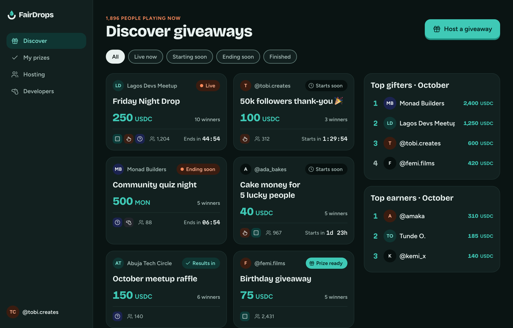

# Discover (desktop)

**Flow:** Desktop · **Route (proposed):** `/`

Find giveaways, and see who gives and wins the most.

| Light                                                        | Dark                                                       |
| ------------------------------------------------------------ | ---------------------------------------------------------- |
|  |  |

## Layout, top to bottom

- Left nav (232px): logo; Discover · My prizes · Hosting · Developers; the account at the bottom.
- Header: flare overline "1,896 people playing now", "Discover giveaways", and the primary "Host a giveaway".
- Filter pills: All · Live now · Starting soon · Ending soon · Finished.
- A GiveawayCard grid (`minmax(260px,1fr)`) and a 340px side column with two leaderboards: "Top gifters · October" and "Top earners · October".

## States

- **Empty filter:** "Nothing live right now." and the next start time.
- **Mobile:** a single column, with the leaderboards below the grid under a tab.

## Data

- `fd.giveaways.list({ status: "ACTIVE" })`, split into Live / Starting soon / Ending soon by each item's `phase`. Server-side phase filtering would be a new API query parameter.
- The gifter and earner boards need a new API endpoint (see [Open questions](../DESIGN.md#open-questions)).

## Navigation

- Card → Giveaway page.
