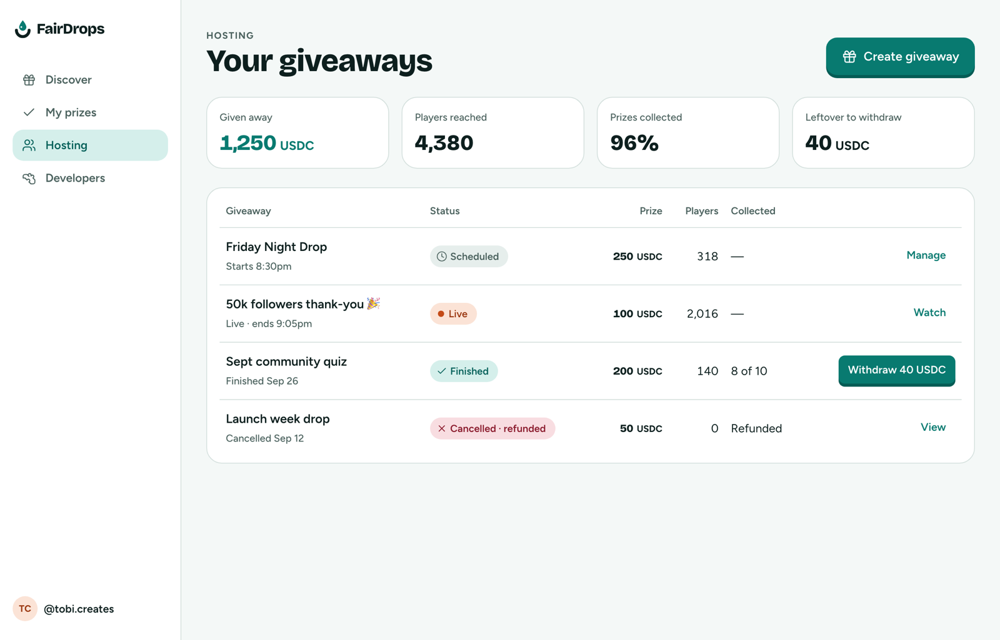
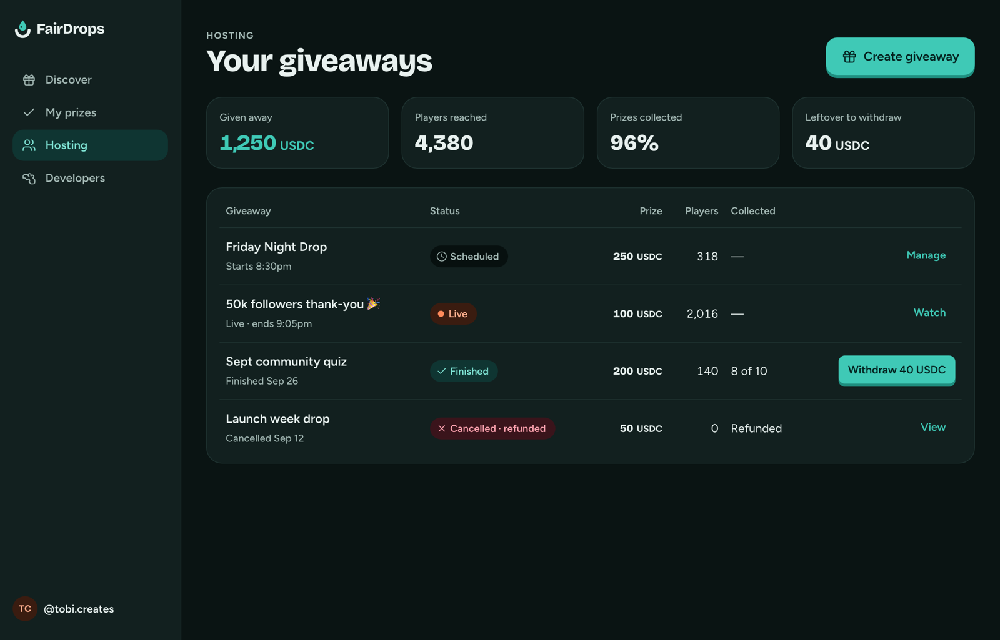

# Hosting dashboard (desktop)

**Flow:** Desktop · **Route (proposed):** `/host`

Every giveaway a host has run, and what needs action.

| Light                                                                | Dark                                                               |
| -------------------------------------------------------------------- | ------------------------------------------------------------------ |
|  |  |

## Layout, top to bottom

- Header "Your giveaways" and "Create giveaway".
- Four KPI cards: Given away · Players reached · Prizes collected (%) · Leftover to withdraw.
- Table: Giveaway (title and when) · Status chip · Prize · Players · Collected · a row action (Manage, Watch, "Withdraw 40 USDC" as primary, View).

## States

- **Empty:** the same pitch as mobile Hosting home.

## Data

- `fd.giveaways.list({ host: me })`, and `withdrawable` per finalized giveaway.

## Navigation

- Row → Manage.
