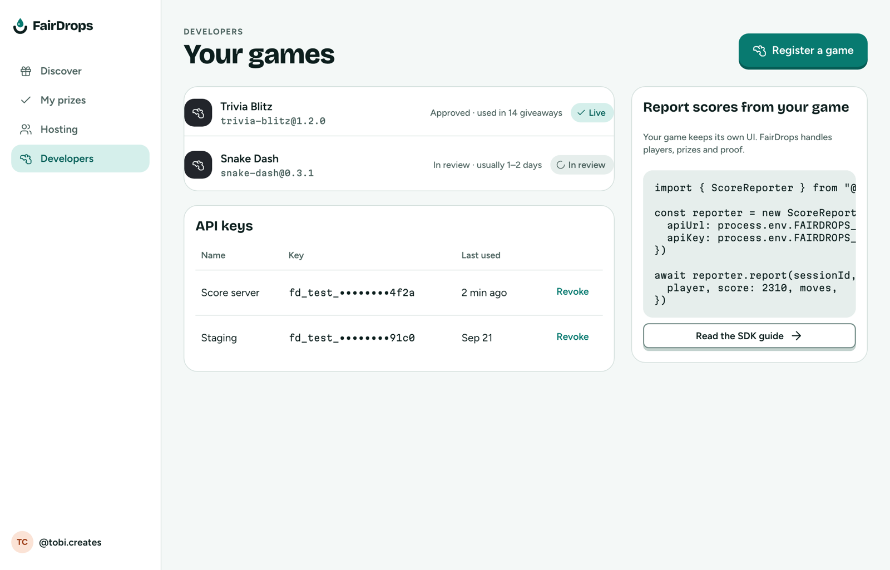
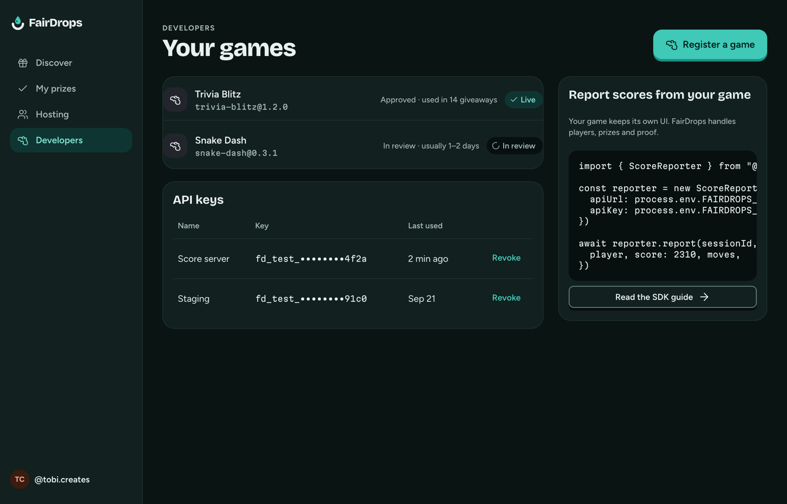

# Developers (desktop)

**Flow:** Desktop · **Route (proposed):** `/developers`

Register third-party games and manage API keys. Games keep their own UI.

| Light                                                            | Dark                                                           |
| ---------------------------------------------------------------- | -------------------------------------------------------------- |
|  |  |

## Layout, top to bottom

- Header "Your games" and "Register a game".
- Games list: stage-custom icon, name and `id@version` (mono), a status line, and a chip (Live = `APPROVED`, In review = `PENDING_REVIEW`).
- API keys table: name, masked key (`fd_test_••••4f2a`), last used, and Revoke.
- A side card "Report scores from your game" with a `ScoreReporter` code sample and "Read the SDK guide".

## States

- **New key created:** show the full key once, in a copy field, with "You won't see this again".
- Game statuses: `DRAFT` · `PENDING_REVIEW` · `APPROVED` · `DISABLED`.

## Data

- Game definitions and API-key endpoints (scopes `scores:write`, `sessions:read`).
- `ScoreReporter` from `@fairdrops/sdk/server`.
