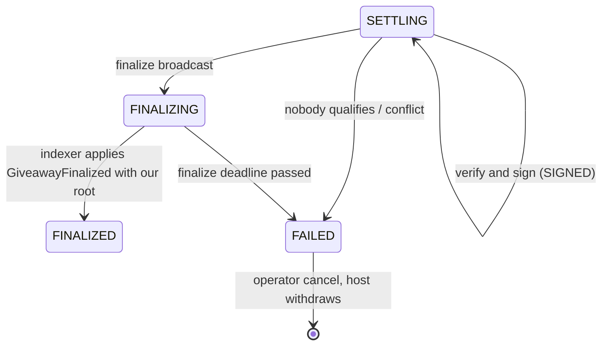

# Plan: settlement end to end, and the SDK

Status: **implemented**, except the run on live testnets (it needs funded keys; see
[settlement.md](../settlement.md#end-to-end-on-testnet)). Target environment: **testnet**.

The result is documented in [settlement.md](../settlement.md) and [sdk.md](../sdk.md). Where the
implementation differs from this plan:

- The confirmation step runs in the settlement reconciler, which reads the indexed giveaway,
  rather than in the indexer's projector. The indexer stays the only writer of on-chain tables.
- Verifiers poll for proposals instead of taking queued jobs, so a verifier-only process needs no
  queue, only the database and an RPC.
- The SDK's integration tests live in `apps/api/test/sdk.test.ts`, next to the API harness they
  run against. The end-to-end runner is the `apps/e2e` workspace package.
- The external game server and plain-page examples are in [sdk.md](../sdk.md) as snippets; the
  `external` end-to-end scenario is the runnable version of the server one.
- The missed-deadline scenario is covered by the worker tests: on a testnet it needs a giveaway
  to sit unsettled for at least the contract's 10-minute minimum window.

This run delivers two things:

1. **Settlement and finalization working end to end on testnet.** A real giveaway goes from
   creation to a claimed prize, and anyone can verify the result.
2. **`@fairdrops/sdk`**, the client library every interface uses: our web app (later), third-party
   game UIs, external game servers, and scripts.

The web UI is **out of scope** for this run. It needs a design system to vet first; see
[Web UI: next run](#web-ui-next-run).

## Where things stand

| Piece                                           | State                                                                      |
| ----------------------------------------------- | -------------------------------------------------------------------------- |
| Contract: `finalize`, `claim`, `claimMany`      | Done, tested, invariants, deployed on four testnets                        |
| Indexer: `GiveawayFinalized`, `Claimed` events  | Done: the `giveaways` row and `giveaway_events` are updated                |
| Sessions up to `SETTLING`                       | Done: ranking, revealed seed and transcript are stored                     |
| **`SETTLING` → `FINALIZING` → `FINALIZED`**     | **Missing.** Nothing moves a session past `SETTLING`                       |
| **Payout computation, Merkle tree, signatures** | **Missing**                                                                |
| **Submitting `finalize`, relaying claims**      | **Missing**                                                                |
| **Giveaway read API**                           | **Missing.** The indexer fills `giveaways`, but no route serves them       |
| **SDK**                                         | **Missing.** `play-session.ts` hand-rolls sign-in, REST and the socket     |
| Testnet end to end                              | **Missing.** `play-session.ts` stands in for the chain and never finalizes |

The contract side needs **no changes**, so the addresses deployed on the testnets stay valid.

## Environments

| Layer                                       | Talks to                                       |
| ------------------------------------------- | ---------------------------------------------- |
| Foundry tests, deploy scripts, contract CLI | Anvil                                          |
| API, worker, game-kit, settlement, SDK, web | **Testnet** (`DEPLOYMENT_ENVIRONMENT=testnet`) |
| Unit and integration tests of apps and SDK  | Fakes of the chain ports; no chain at all      |
| End-to-end                                  | Real testnets                                  |

Change: Anvil moves behind a `contracts` profile in `infra/compose.yaml`, so `pnpm infra:up`
starts only Postgres and Redis. Contract developers run `docker compose --profile contracts up`.

## Part A: settlement and finalization

### A1. Reward policy

The contract only sees a Merkle root and `maxWinners`, so how the prize is split must be part of
the metadata the host commits on-chain. Otherwise verifiers could split it any way.

- **Metadata v2** adds `rewards` to `giveawayMetadataSchema`, alongside v1 in the existing
  discriminated union:
  - `{ kind: "equal", winners, minScore? }`: the top `winners` share equally.
  - `{ kind: "weighted", bps: number[], minScore? }`: a share per rank, summing to 10,000.
- **v1 documents keep working.** They get `{ kind: "equal", winners: maxWinners, minScore: 1 }`.
- **Rules:**
  - The prize basis is the on-chain `prize`. Top-ups via `addFunds` are only possible before the
    start, so it is fixed once play begins.
  - All maths is integer maths with floor division.
  - Dust stays in escrow and returns to the host through `withdraw`.
- If nobody qualifies there is no settlement, and the session takes the unwind path (A6).
- The planner rejects a policy that is invalid for `maxWinners` when the session is planned, like
  invalid game settings today.

### A2. `packages/settlement`

A new package, pure and runnable in the browser like `game-kit`, so the worker, the SDK and any
third party run the same code:

| Export                                               | Does                                                                                                                                                      |
| ---------------------------------------------------- | --------------------------------------------------------------------------------------------------------------------------------------------------------- |
| `computePayouts(ranking, policy, prize, maxWinners)` | `{ account, amount }[]`, deterministic                                                                                                                    |
| `buildPayoutTree(giveawayId, payouts)`               | OpenZeppelin `StandardMerkleTree` over `["bytes32","address","uint256"]`                                                                                  |
| `settlementTypedData(chainId, contract, id, s)`      | EIP-712 domain, types and message for `Settlement`                                                                                                        |
| `verifySettlement(input)`                            | Replays the transcript, or checks the report signature, then recomputes the payouts, root and `transcriptHash` and checks the seed against the commitment |

Parity fixtures are generated once by a Foundry script and committed: leaves, a root and
`settlementDigest` values. The TypeScript tests compare against them, so no chain is needed.

### A3. Pipeline in the worker

The pipeline follows the runtime's existing rules. Every transition is
`UPDATE … WHERE status = <expected>`, and every step is a BullMQ job with a deterministic id. The
planner's `reconcile` re-queues any step whose job was lost.



1. **Build.**
   - Read the giveaway from the chain, not the indexed row. It must be `Active`, the seed
     commitment must match, and the prize is read directly.
   - Compute the payouts and the tree.
   - In one transaction, insert `Settlement` (`PROPOSED`) and its `SettlementPayout` rows.
2. **Verify and sign** (A4) until the on-chain `verifierThreshold` is reached: `SIGNED`.
3. **Submit** through the transaction engine (A5). The session moves to `FINALIZING` once the
   transaction is broadcast.
4. **Confirm.** The indexer is the source of truth.
   - When the projector applies `GiveawayFinalized`, it moves the session to `FINALIZED` only if
     `payoutRoot` and `transcriptHash` match ours.
   - A mismatch means someone else settled the giveaway with different data. The projector alerts
     and halts, like the existing reorg halt.
5. **Watch the deadline.**
   - `FINALIZING` within `SESSION_SETTLEMENT_MARGIN_SECONDS` of `finalizeDeadline` raises an alert.
   - Once the deadline has passed, the session is `FAILED`. The host's `withdraw` then expires the
     giveaway and refunds everything.

### A4. Verifiers

- There is a `SettlementSigner` port. On testnet it is a local key from `VERIFIER_PRIVATE_KEYS`
  (comma-separated). A KMS adapter comes later for mainnet.
- **Each verifier recomputes the result independently** from the transcript and on-chain state
  with `verifySettlement`, and signs only if its root and total match the proposal.
- Before signing, the local digest is cross-checked against the contract's `settlementDigest`
  view. This is a read, so it costs no gas.
- Signatures are sorted by signer address, as the contract requires.
- It runs as a worker module. With `VERIFIER_ONLY=true` the same image runs only verification, so
  a threshold of two can run as two processes.

### A5. Transaction engine

Seed commits currently rely on viem's in-process `nonceManager`, which is only safe with a single
worker. One engine will handle every chain write, and seed commits move onto it first.

- **`chain_transactions` ledger:**
  - columns: `chainId`, `from`, `nonce`, `kind` (`COMMIT_SEED`, `FINALIZE`, `CLAIM`, `CANCEL`),
    `ref`, `hash`, `status`, fees, `replaces`, `attempts`;
  - `(chainId, from, nonce)` is unique.
- **One sender per `(chainId, key)`**, held with a Redis lock. The nonce is allocated from the
  ledger and written **before** broadcasting, so a crash cannot lose a transaction that was
  actually sent.
- **Sending steps:**
  1. simulate;
  2. estimate gas with a small buffer (Monad bills the gas limit, not gas used, so no flat
     multiplier);
  3. send over viem's `fallback` transport across the chain's `rpcUrls`, with per-chain overrides
     in `RPC_URLS`;
  4. wait for the receipt at the chain's `confirmations`;
  5. if the transaction is stuck, resend the same nonce with higher fees.
- **Reverts are decoded into outcomes:**
  - `InvalidStatus(Finalized)`: already done, since anyone may submit a settlement. Wait for the
    indexer.
  - `TooLate`: take the unwind or expiry path.
  - `InsufficientSignatures`, `UnauthorizedSigner`: a configuration error. Alert and stop retrying.
- **Keys are separate even on testnet:**
  - operator: commits seeds and cancels;
  - verifiers: sign only and hold no gas;
  - relayer: submits `finalize` and claims, and pays gas.
- `/health` reports each key's balance on each chain and warns when it is low.

### A6. Claims and unwinding

- **Relayed claims** are on by default on testnet, with a switch per chain.
  - After `FINALIZED`, the relayer submits `claimMany` in batches bounded by gas.
  - One bad claim reverts the whole batch, so the relayer filters with `isClaimed`, simulates, and
    on a revert splits the batch and retries.
  - Players who signed in with Web3Auth have no gas, so this is how they are paid.
- **Self-claims** go through the SDK (`claim(id, account, amount, proof)`).
- `Claimed` events set `claimedAt` and `claimTx` on `SettlementPayout`.
- **Unwind.** A `FAILED` or `CANCELLED` session whose giveaway is still `Active` gets a `CANCEL`
  job: the operator calls `cancel(id)`, and the host then withdraws the full refund, fee included.

### A7. Data model (one migration)

- `Settlement`: `sessionId` as primary key, policy, prize basis, `totalPayout`, `winnerCount`,
  `payoutRoot`, the tree dump, digest, status (`PROPOSED`, `SIGNED`, `SUBMITTED`, `CONFIRMED`,
  `ABANDONED`) and the finalize transaction.
- `SettlementPayout`: `sessionId`, `account`, `amount`, `proof`, `claimedAt`, `claimTx`.
- `SettlementSignature`: `sessionId`, `verifier`, `signature`.
- `ChainTransaction`, as in A5.
- `CHECK` constraints in the style of the existing ones, for example that a `SIGNED` settlement
  has a digest.

### A8. API additions

| Route                                        | Access                    | Returns                                                 |
| -------------------------------------------- | ------------------------- | ------------------------------------------------------- |
| `GET /giveaways`                             | Public, cursor pagination | Indexed giveaways; filter by chain, status, host, phase |
| `GET /giveaways/:chainId/:giveawayId`        | Public                    | One giveaway with its metadata and session              |
| `GET /giveaways/:chainId/:giveawayId/events` | Public, cursor pagination | Its on-chain activity log                               |
| `GET /sessions/:id/settlement`               | Public, once `SIGNED`     | Policy, payouts, root, signatures, transaction, status  |
| `GET /sessions/:id/payout-tree`              | Public, once `SIGNED`     | OpenZeppelin tree dump                                  |
| `GET /claims/:chainId/:giveawayId/:account`  | Public                    | Amount, proof, claimed or not, payout wallet            |
| `GET /me/claims`                             | Signed in                 | The user's claims across chains and wallets             |

- The WebSocket `status` message also carries `FINALIZING`, `FINALIZED` and claim updates.
- Every response schema lives in `@fairdrops/shared`.

## Part B: `@fairdrops/sdk`

### Who uses it

| Consumer                     | Needs                                                            |
| ---------------------------- | ---------------------------------------------------------------- |
| Our web app (next run)       | Everything below, plus React bindings later                      |
| A third-party game UI        | Sign in, join, play over the socket, show results, claim         |
| An external game server      | Read players, sign and post a score report                       |
| A host's script or dashboard | Create, fund, cancel and withdraw giveaways                      |
| Anyone checking a result     | Verify a settlement against the chain, with no FairDrops account |
| Our end-to-end tests         | All of it, headless in Node                                      |

### Design rules

- **It never holds keys.** Anything that signs takes a viem `WalletClient`, an EIP-1193 provider,
  or a small `{ address, signMessage, signTypedData }` signer. Web3Auth, injected wallets and
  server keys all fit.
- **Types come from `@fairdrops/shared`.** Every response is validated with its zod schema, so a
  drift between API and SDK fails loudly instead of rendering wrong data.
- **Isomorphic.** It runs in browsers and Node 24. `fetch` and `WebSocket` can be injected (for
  example the `ws` package in Node).
- **Split by use, so apps only bundle what they use.** Subpath exports, with `viem` as a peer
  dependency:

| Import                  | Contents                                                                 |
| ----------------------- | ------------------------------------------------------------------------ |
| `@fairdrops/sdk`        | `FairDrops` client: auth, giveaways, sessions, settlement reads          |
| `@fairdrops/sdk/live`   | The socket client for playing and watching                               |
| `@fairdrops/sdk/host`   | Building and sending create, add funds, cancel and withdraw transactions |
| `@fairdrops/sdk/claims` | Claim transactions and payout wallets                                    |
| `@fairdrops/sdk/verify` | Settlement and transcript verification against the chain                 |
| `@fairdrops/sdk/server` | For external game servers: API-key client and score reporter             |

- **Errors are typed.** API errors map to the codes in `@fairdrops/shared` `errors.ts`.
  Contract reverts are decoded from the ABI (`TooLate`, `AlreadyClaimed`, and so on).

### Surface

```ts
const fd = new FairDrops({ apiUrl, environment: "testnet" });

// Auth (SIWE). Tokens are kept in a pluggable store (memory, localStorage) and refreshed
// automatically; concurrent refreshes share one request.
await fd.auth.signIn(signer, { transport: "body" }); // "cookie" for our own origin
fd.auth.me(); fd.auth.signOut();

// Reads
fd.giveaways.list({ chainId, phase, cursor }); fd.giveaways.get(chainId, id);
fd.sessions.get(id); fd.sessions.byGiveaway(chainId, id); fd.sessions.participants(id);
fd.sessions.join(id); fd.sessions.transcript(id);
fd.settlement.get(sessionId); fd.claims.get(chainId, id, account); fd.claims.mine();

// Live play (sdk/live)
const live = await fd.live.connect();                // gets a ws-ticket when signed in
const room = live.subscribe<DicePublicView, DicePlayerView>(sessionId);
room.on("snapshot" | "public" | "player" | "status", handler);
const result = await room.act({ type: "roll" });    // resolves with the ActionResult for its id

// Host (sdk/host)
const tx = await host.prepareCreate({ chainId, token, amount, startTime, finalizeDeadline,
  maxWinners, metadata });                           // validates + encodes metadata, handles approve
await host.create(walletClient, tx); await host.cancel(...); await host.withdraw(...);

// Claims (sdk/claims)
await claims.claim(walletClient, await fd.claims.get(chainId, id, account));

// Verify (sdk/verify): needs only public data and an RPC
const report = await verify({ chainId, giveawayId, apiUrl, rpcUrl? });
// { ok, checks: [{ name: "seed", ok }, { name: "transcript", ok }, { name: "payoutRoot", ok }, ...] }

// External game server (sdk/server)
const reporter = new ScoreReporter({ apiUrl, apiKey, signer });
await reporter.players(sessionId); await reporter.report(sessionId, ranking, gameTranscriptHash);
```

Game views are typed from `@fairdrops/game-kit`, which exports each built-in game's view types.
A third-party game passes its own view types as generics.

### The live client

It wraps the existing protocol unchanged and adds what every UI would otherwise rewrite:

- Reconnects with jittered backoff, re-subscribes, and resyncs from the `snapshot` on each new
  connection.
- Sends `ping` on a timer, and estimates **clock offset and RTT** from `pong.serverTime`, so games
  can show accurate countdowns.
- Generates action ids and keeps them across resends, so a reconnect never logs an action twice
  (the server already de-duplicates by client id).
- Rate limits on the client at `MAX_ACTIONS_PER_SECOND`, so players get a local error instead of
  a `RATE_LIMITED` from the server.
- Exposes connection state (`connecting`, `open`, `reconnecting`, `closed`) for UIs to show.

### Packaging

- `packages/sdk`, ESM with type declarations, built with `tsc` like the other packages.
- `private: true` for now. Publishing to npm (with changesets) is a separate decision.
- A size budget is checked in CI for the browser entry points.

### Examples

These double as proof that a third party can build on FairDrops:

- `examples/external-game-server`: a minimal Node server that reads players and posts a signed
  score report with `sdk/server`.
- `examples/vanilla-game-ui`: a single HTML page with no framework that signs in, joins and plays
  dice with `sdk` and `sdk/live`.

## Part C: proving it end to end on testnet

A new script, `scripts/e2e/testnet.ts`, drives everything **through the SDK only**. It replaces
the chain stand-in in `play-session.ts`, which stays for quick runtime checks.

| Scenario        | Steps                                                                                                                                                                    | Passes when                                                                                 |
| --------------- | ------------------------------------------------------------------------------------------------------------------------------------------------------------------------ | ------------------------------------------------------------------------------------------- |
| Happy path      | Host creates a giveaway with `sdk/host`; indexer and planner pick it up; seed is committed; players sign in, join and play; verifiers sign; finalize; claims are relayed | Session `FINALIZED`; winners' balances rose by their payouts; `verify()` passes every check |
| Self-claim      | As above with relaying off; a winner claims with `sdk/claims`                                                                                                            | `Claimed` indexed; a second claim fails with `AlreadyClaimed`                               |
| Nobody plays    | Create; nobody joins                                                                                                                                                     | Operator cancels; host withdraws the full deposit                                           |
| External game   | `examples/external-game-server` reports a ranking                                                                                                                        | Finalized with the reported order; `verify()` checks the reporter signature                 |
| Missed deadline | Short deadline; settlement disabled                                                                                                                                      | Host `withdraw` expires the giveaway and refunds the full deposit                           |

- **Chains:** Base Sepolia first (fast blocks, reliable Goldsky), then Monad Testnet and Sepolia.
  Polkadot Hub is excluded because Goldsky does not index it.
- **Keys:** host, relayer and operator keys, funded from faucets. Player keys are generated per
  run. The `/health` balance report warns before runs start failing.
- **CI:**
  - Unit and integration tests run on every push, as today.
  - The testnet scenarios run **nightly** and on demand, as a matrix over chains, with keys in
    GitHub secrets.

## Build order

Each step ends with `pnpm verify` green.

| #   | Step                                                                                                  | Done when                                                                              |
| --- | ----------------------------------------------------------------------------------------------------- | -------------------------------------------------------------------------------------- |
| 1   | Anvil behind a compose profile; transaction engine and `ChainTransaction`; seed commits moved onto it | Seed commits on testnet go through the ledger; two workers never reuse a nonce         |
| 2   | `packages/settlement` with Foundry parity fixtures; metadata v2 reward policies                       | Property tests and fixture tests pass                                                  |
| 3   | Migration; build, verify and sign steps                                                               | A `SETTLING` session reaches `SIGNED` in worker tests with fake chain ports            |
| 4   | Submit, indexer confirmation, deadline watchdog, unwind                                               | Worker tests cover crashes between steps, a lost race to submit, each revert outcome   |
| 5   | Relayed claims; giveaway, settlement and claim routes; shared schemas                                 | API tests pass                                                                         |
| 6   | SDK core, `live` and `verify`                                                                         | SDK integration tests pass against the API test harness (Postgres and Redis, no chain) |
| 7   | SDK `host`, `claims` and `server`; examples                                                           | Examples run against testnet                                                           |
| 8   | `scripts/e2e/testnet.ts`, all scenarios on Base Sepolia, then Monad and Sepolia; nightly CI           | Every scenario passes on three testnets                                                |
| 9   | Docs: `docs/settlement.md`, `docs/sdk.md`; updates to `game-runtime.md`, `deployment.md`, the README  | Reviewed                                                                               |

Steps 2 and 6 do not depend on each other and can run in parallel.

## Decisions (defaults, change any before we start)

| Decision                      | Default                                             | Alternative                                        |
| ----------------------------- | --------------------------------------------------- | -------------------------------------------------- |
| Claims on testnet             | Relayed by default, self-claim also available       | Self-claim only                                    |
| Verifier threshold on testnet | 1, with the code built for N and a two-process test | 2 on the deployed contracts, via admin `grantRole` |
| Transcript availability       | Served by the API from Postgres                     | Also pinned to IPFS                                |
| Reward policy in metadata     | v2 with `rewards`; v1 treated as equal split        | Optional field added to v1                         |
| SDK distribution              | Private workspace package                           | Published to npm                                   |
| React bindings                | Deferred to the web run                             | `@fairdrops/sdk/react` now                         |

## Risks

- **Faucet limits and public RPC reliability** can make testnet runs flaky. Mitigations: RPC
  fallbacks, per-chain RPC overrides, balance warnings, and retries in the nightly job before it
  reports a failure.
- **Goldsky lag** delays `FINALIZED` and claim updates. The SDK exposes `FINALIZING` with the
  transaction hash, so UIs can show progress.
- **Metadata v2 is a format change.** Giveaways created with v2 before the indexer understands it
  would be marked invalid, so the indexer and planner ship before any client writes v2.

## Web UI: next run

The web app waits for a design system you can vet. The next run starts with the artifacts below,
before any UI code:

1. **Design system:** colour, type, spacing and radius tokens, light and dark; core components
   (buttons, inputs, cards, badges, status chips, toasts, dialogs); motion rules.
2. **Screen inventory and flows**, each screen's states (loading, empty, error, success):
   - _Discover:_ giveaway list and filters; giveaway detail (prize, rules, game, timeline,
     on-chain activity).
   - _Play:_ sign in (Web3Auth and injected); lobby; live game (dice, quiz); results.
   - _Settle:_ claim; "verify this result" report; my prizes across chains.
   - _Host:_ create giveaway (token, prize, schedule, winners, reward policy, game and settings);
     fund and approve; manage (cancel, withdraw refund or remainder); host profile.
   - _Developers:_ register an external game; API keys; review status.
   - _Admin:_ game review queue; question banks.
3. **Clickable prototype** of the play and claim flows for sign-off.

Only then does the web app get built on `@fairdrops/sdk`.
