# Settlement and finalization

When a game ends, its session is `SETTLING`: the ranking, the revealed seed and the transcript are
stored ([game-runtime.md](game-runtime.md)). Settlement turns that into money on-chain: payouts
under the host's reward policy, a Merkle root signed by verifiers, `finalize` on the contract, and
prizes claimed by, or for, every winner. Anyone can check the result independently afterwards.

```mermaid
stateDiagram-v2
    SETTLING --> SETTLING: build (settlement PROPOSED)
    SETTLING --> SETTLING: verifiers sign (SIGNED)
    SETTLING --> FINALIZING: finalize broadcast (SUBMITTED)
    FINALIZING --> FINALIZED: indexer sees GiveawayFinalized with our root (CONFIRMED)
    SETTLING --> FAILED: nobody qualified, a fatal revert
    FINALIZING --> FAILED: finalize deadline passed, or a different result on-chain
    SETTLING --> CANCELLED: giveaway cancelled or expired on-chain
    FAILED --> [*]: operator cancels the giveaway; host withdraws a full refund
```



| Session status | Settlement status | Meaning                                                 |
| -------------- | ----------------- | ------------------------------------------------------- |
| `SETTLING`     | none              | The game is over; payouts not computed yet              |
| `SETTLING`     | `PROPOSED`        | Payouts computed, waiting for verifier signatures       |
| `SETTLING`     | `SIGNED`          | Enough signatures to finalize                           |
| `FINALIZING`   | `SUBMITTED`       | `finalize` sent; waiting for it to be mined and indexed |
| `FINALIZED`    | `CONFIRMED`       | The chain recorded this result; winners can claim       |
| `FAILED`       | `ABANDONED`       | It can never be finalized; the reason is recorded       |

## Reward policies

The contract only sees a Merkle root and `maxWinners`, so the split is part of the metadata the
host commits on-chain (metadata v2, `rewards`). Verifiers cannot choose it.

| Policy                                 | Pays                                                         |
| -------------------------------------- | ------------------------------------------------------------ |
| `{ kind: "equal", winners, minScore }` | Each of the top `winners` places gets `prize / winners`      |
| `{ kind: "weighted", bps, minScore }`  | Place `i` gets `bps[i] / 10000` of the prize (sums to 10000) |

- `minScore` defaults to 1, so players who joined and never played cannot win.
- Places are filled in rank order by players who reach `minScore`. Unfilled places and rounding
  dust stay in escrow and go back to the host with `withdraw` after finalization.
- The prize basis is the escrowed `prize` on-chain, fixed once the giveaway starts (`addFunds`
  is refused after the start).
- If nobody qualifies there is nothing to finalize (the contract needs at least one winner): the
  session fails and the giveaway is cancelled so the host is refunded.
- v1 metadata predates policies and pays `{ kind: "equal", winners: maxWinners, minScore: 1 }`.
- A policy with more places than `maxWinners` fails the session at planning.

The rules live in one place, `@fairdrops/settlement` (`computePayouts`), which the worker, every
verifier, the SDK and any third party run unchanged.

## `@fairdrops/settlement`

A package with no server dependencies:

| Export                                    | Does                                                                              |
| ----------------------------------------- | --------------------------------------------------------------------------------- |
| `computePayouts`                          | Ranking + policy + prize → `{ account, amount, rank }[]`, deterministic           |
| `computeSettlement`                       | The payouts, their Merkle tree, root, total and winner count (null if none)       |
| `PayoutTree`                              | OpenZeppelin `StandardMerkleTree` over `(bytes32 id, address, uint256)`           |
| `settlementTypedData`, `settlementDigest` | The EIP-712 `Settlement` verifiers sign; equals the contract's `settlementDigest` |
| `sortSettlementSignatures`                | Orders signatures by signer, as `finalize` requires                               |
| `verifySettlement`                        | Checks a settlement from public data (below)                                      |

### Parity with the contract

`packages/contracts/test/fixtures/settlement-parity.json` is generated from the TypeScript side
and checked on both sides: `parity.test.ts` in the settlement package fails if it is stale, and
`FairDrops.parity.t.sol` deploys the contract at the fixture's address on the fixture's chain id
and checks every leaf against `payoutLeaf`, every proof with `MerkleProof.verify`, the digest
against `settlementDigest` and the signature's signer. If the two ever disagreed, claims or
`finalize` would revert on-chain; this makes it a failing test first.

```bash
pnpm --filter @fairdrops/settlement fixtures   # rewrite the fixture after an intended change
```

## Verification

`verifySettlement` is what a verifier runs before signing, and what anyone can run afterwards:

| Check            | Passes when                                                                                                                                                  |
| ---------------- | ------------------------------------------------------------------------------------------------------------------------------------------------------------ |
| `transcript`     | The transcript is well-formed                                                                                                                                |
| `giveaway`       | It is for this chain, contract and giveaway                                                                                                                  |
| `game`           | It plays the game and settings the host committed to on-chain                                                                                                |
| `seed`           | Its seed hashes to the commitment made on-chain before the start                                                                                             |
| `result`         | Hosted: replaying every action gives the same standings. External: the standings carry a valid signature from the game's reporter key, in the reported order |
| `transcriptHash` | It hashes to the settled `transcriptHash`                                                                                                                    |
| `payouts`        | The host's policy applied to the standings gives the settled root, total and count                                                                           |

The SDK's `verifyGiveaway` adds two more: the metadata FairDrops serves hashes to the on-chain
`metadataHash`, and the published payout tree has the settled root.

## The pipeline

All of it runs in `apps/worker`, in `src/settlement`, and follows the same rules as the session
runtime: every transition is `UPDATE … WHERE status = <expected>`, so racing workers cannot both
apply one, and every step is a BullMQ job keyed by step and session.

| Step    | Component              | What it does                                                                                                                                               |
| ------- | ---------------------- | ---------------------------------------------------------------------------------------------------------------------------------------------------------- |
| Build   | `SettlementBuilder`    | Reads the giveaway **from the chain** (status, prize, seed commitment), computes the settlement and stores it with every payout's proof in one transaction |
| Verify  | `SettlementVerifier`   | Each configured verifier key checks the proposal independently (below) and signs it; at the on-chain `verifierThreshold` it becomes `SIGNED`               |
| Submit  | `SettlementSubmitter`  | Sends `finalize` with the signatures of current verifiers, sorted by signer, through the transaction engine                                                |
| Confirm | `SettlementReconciler` | Marks the settlement `CONFIRMED` and the session `FINALIZED` once the **indexer** has applied `GiveawayFinalized` with our root and transcript hash        |
| Claim   | `ClaimRelayer`         | Claims every open prize with `claimMany`, paying the gas, so winners need no native currency                                                               |
| Unwind  | `GiveawayUnwinder`     | Cancels on-chain the giveaway of a game that ended without a result, so the host is refunded now                                                           |

The reconciler runs on one worker at a time (a Redis lease) every `SETTLEMENT_INTERVAL_MS`. Each
pass follows transactions in flight, moves settlements forward from their state, copies indexed
`Claimed` events onto payouts, and schedules the next step of each. A step that finds the chain
has not caught up yet runs again at most every 15 seconds (claims every 5 minutes).

### Verifiers check, they do not rubber-stamp

A verifier signs only after it has, on its own:

1. confirmed its key holds `VERIFIER_ROLE` on that contract;
2. checked the stored metadata against the on-chain `metadataHash`;
3. run `verifySettlement` against the published transcript and the on-chain prize, winner count
   and seed commitment (for external games, against the reporter key the game registered);
4. compared its digest with the contract's own `settlementDigest`.

A proposal it refuses is logged with the failing checks and looked at again 10 minutes later.
Verifiers need only the database and an RPC. Run them as their own processes, each with its own
key, to spread trust (see [Keys](#keys)).

### What can go wrong

| Situation                                                                                                        | What happens                                                                                                |
| ---------------------------------------------------------------------------------------------------------------- | ----------------------------------------------------------------------------------------------------------- |
| Nobody reached `minScore`                                                                                        | Session `FAILED` ("Nobody scored enough to win a prize"); the giveaway is cancelled; host refunded          |
| `finalize` reverts `TooLate`, `SeedMismatch`, `InvalidSettlement`, `PayoutExceedsPrize`                          | Settlement `ABANDONED`, session `FAILED`                                                                    |
| `finalize` reverts `InsufficientSignatures`, `UnauthorizedSigner`, `SignersNotSorted` (a verifier lost its role) | Signatures are dropped and verifiers sign again                                                             |
| The finalize transaction reverts or is dropped after sending                                                     | The settlement goes back to `SIGNED` and is sent again                                                      |
| Someone else finalizes first with the same result                                                                | Confirmed like our own: anyone may submit a signed settlement                                               |
| The giveaway is finalized with a **different** result                                                            | Settlement `ABANDONED`, session `FAILED`, logged as an error (a verifier threshold was compromised)         |
| The finalize deadline passes                                                                                     | Settlement `ABANDONED`, session `FAILED`; the host's `withdraw` expires the giveaway and refunds everything |
| The host cancels, or the giveaway expires                                                                        | Session `CANCELLED`, settlement `ABANDONED`                                                                 |
| One claim in a batch cannot succeed                                                                              | The batch is split until the bad claim is on its own; everyone else is paid                                 |

A warning is logged when a result is not finalized within half of
`SESSION_SETTLEMENT_MARGIN_SECONDS` of the deadline.

## Transactions

Every transaction the worker sends (seed commits, `finalize`, relayed claims, cancellations) goes
through `TxEngine` (`src/chain/tx-engine.ts`) and is recorded in `chain_transactions`:

- **One sender per chain and key at a time**, under a Redis lock. The nonce is the higher of the
  chain's pending count and the ledger's in-flight transactions. A partial unique index on
  `(chain, sender, nonce)` stops two rows taking one nonce if the lock is ever held twice.
- **Write-ahead.** The signed transaction is stored before it is broadcast. If the process dies,
  or the broadcast times out, the next pass rebroadcasts the same bytes, so a nonce is never lost
  or used twice.
- **One transaction in flight per intent** (kind and reference): a retried job follows the
  transaction it already sent instead of sending another. Also a partial unique index.
- **Simulate first.** A call that would revert throws `ContractRevert` with the contract's error
  name and is never sent.
- **Receipts** wait for the chain's `confirmations` from the registry.
- **Stuck transactions** are resent at the same nonce with fees 12.5% higher (up to
  `TX_MAX_FEE_BUMPS`); one whose nonce was used by another transaction is marked `DROPPED`, and
  its owner sends again.
- **Gas** is the estimate plus 15%, not a flat multiple: Monad charges for the gas limit.
- **RPC** goes through every URL configured for the chain (`RPC_URLS` first, then the registry's),
  falling back to the next on failure.

## Claims

- **Relayed** (default): after `FINALIZED`, the relayer claims every open prize with `claimMany`,
  checking `isClaimed` on-chain first so the indexer's lag never causes a revert. Prizes go to
  each winner, or their payout wallet; the relayer only pays the gas.
- **Self-claim**: `GET /claims/:chainId/:giveawayId/:account` returns the amount and proof, and
  `claimPrize` in `@fairdrops/sdk/claims` sends `claim`. Works whether or not relaying is on.
- Indexed `Claimed` events mark payouts claimed (`claimedAt`, `claimTx`).
- After the claim window, the host reclaims anything unclaimed with `withdraw`.

## API

| Route                                        | Access         | Returns                                                                                |
| -------------------------------------------- | -------------- | -------------------------------------------------------------------------------------- |
| `GET /giveaways`                             | Public, cursor | Indexed giveaways, newest first; filter `chainId`, `status`, `host`                    |
| `GET /giveaways/:chainId/:giveawayId`        | Public         | One giveaway: metadata (and its raw bytes), reward policy, phase, session              |
| `GET /giveaways/:chainId/:giveawayId/events` | Public, cursor | Its on-chain activity, oldest first                                                    |
| `GET /sessions/:id/settlement`               | Public         | Policy, payouts, root, signatures, finalize transaction, status; 409 before one exists |
| `GET /sessions/:id/payout-tree`              | Public         | The OpenZeppelin `StandardMerkleTree` dump                                             |
| `GET /claims/:chainId/:giveawayId/:account`  | Public         | Amount, proof, recipient, whether it can be claimed now                                |
| `GET /me/claims`                             | Signed in      | Prizes won by any wallet linked to the user                                            |

Response schemas are in `@fairdrops/shared` (`settlement.ts`). A session's seed, ranking and
transcript hash are public once the game is over, including when its settlement then failed.

## Keys

| Key                     | Holds           | Pays gas | Does                                                               |
| ----------------------- | --------------- | -------- | ------------------------------------------------------------------ |
| `OPERATOR_PRIVATE_KEY`  | `OPERATOR_ROLE` | Yes      | Commits seeds, cancels giveaways of failed games                   |
| `RELAYER_PRIVATE_KEY`   | Nothing         | Yes      | Sends `finalize` and relayed claims (defaults to the operator key) |
| `VERIFIER_PRIVATE_KEYS` | `VERIFIER_ROLE` | No       | Signs settlements it has checked                                   |

Keep the relayer and operator funded on every chain the deployment serves; the reconciler logs a
warning when either drops below `LOW_BALANCE_WEI`. On testnet, the faucets in
[deployment.md](deployment.md) are enough for hundreds of games.

A verifier-only process:

```bash
SESSIONS_ENABLED=false INDEXER_ENABLED=false SETTLEMENT_ENABLED=false \
VERIFIER_PRIVATE_KEYS=0x... node apps/worker/dist/main.js
```

With `FAIRDROPS_VERIFIER_THRESHOLD=2` on the contract and two such processes (or two keys in one),
no single machine can pay the wrong people.

## Configuration

| Variable                 | Default  | Meaning                                                                |
| ------------------------ | -------- | ---------------------------------------------------------------------- |
| `SETTLEMENT_ENABLED`     | `true`   | Build, submit and confirm settlements, relay claims, unwind            |
| `SETTLEMENT_INTERVAL_MS` | `3000`   | Reconciler and verifier pass interval                                  |
| `VERIFIER_PRIVATE_KEYS`  |          | Comma-separated verifier keys this process signs with                  |
| `RELAYER_PRIVATE_KEY`    | operator | Pays for `finalize` and relayed claims                                 |
| `CLAIM_RELAY_ENABLED`    | `true`   | Claim for winners after finalization                                   |
| `CLAIM_BATCH_SIZE`       | `25`     | Claims per `claimMany`                                                 |
| `UNWIND_ENABLED`         | `true`   | Cancel giveaways of games that ended without a result                  |
| `RPC_URLS`               |          | `chainId=url,...`, tried before the registry's public RPCs             |
| `TX_RECEIPT_TIMEOUT_MS`  | `90000`  | How long a step waits for a receipt before leaving it to the next pass |
| `TX_BUMP_AFTER_MS`       | `60000`  | Resend with higher fees after this long unmined                        |
| `TX_MAX_FEE_BUMPS`       | `5`      | Fee increases per transaction                                          |
| `LOW_BALANCE_WEI`        | `10^16`  | Warn when a paying key has less on a chain                             |

## Testing

| Level                                        | Where                                            | Chain                                                                                          |
| -------------------------------------------- | ------------------------------------------------ | ---------------------------------------------------------------------------------------------- |
| Payout maths, tree, typed data, verification | `packages/settlement/test`                       | None; parity fixture shared with Foundry                                                       |
| Contract parity                              | `packages/contracts/test/FairDrops.parity.t.sol` | Foundry                                                                                        |
| Transaction engine                           | `apps/worker/test/tx-engine.test.ts`             | `FakeChain`: real signed transactions, nonces, receipts                                        |
| Settlement pipeline                          | `apps/worker/test/settlement.test.ts`            | `FakeChain`: enforces signatures, seed, deadline, proofs; events go through the real projector |
| API routes                                   | `apps/api/test/giveaways.test.ts`                | None                                                                                           |
| SDK against the API                          | `apps/api/test/sdk.test.ts`                      | A stub public client for verification                                                          |
| End to end                                   | `apps/e2e`                                       | **Real testnets**                                                                              |

`FakeChain` (`apps/worker/test/fake-chain.ts`) is an in-memory FairDrops that checks what
settlement depends on the way the contract does, so the worker tests exercise real EIP-712
signatures, Merkle proofs and signed transactions without a node.

## End to end on testnet

`apps/e2e` drives a running deployment (API and worker, indexing the chain) through the SDK only,
the way a third party would. Scenarios:

| Scenario     | Steps                                                                                                                       | Passes when                                                                                                                                                                                                |
| ------------ | --------------------------------------------------------------------------------------------------------------------------- | ---------------------------------------------------------------------------------------------------------------------------------------------------------------------------------------------------------- |
| `play`       | Host escrows a prize (weighted 60/30/10); players sign in with SIWE, join, play dice over the WebSocket; the worker settles | Session `FINALIZED`; `verifyGiveaway` passes every check against the chain; each winner's balance rises by exactly their payout; a second claim reverts `AlreadyClaimed`; the host withdraws any remainder |
| `no-players` | Host escrows a prize; nobody joins                                                                                          | The session is cancelled, the operator cancels on-chain, the host is owed and withdraws the full deposit, fee included                                                                                     |
| `external`   | An external game's server reports standings with `ScoreReporter`                                                            | Finalized, and verified against the reporter key                                                                                                                                                           |

```bash
pnpm turbo run build --filter=@fairdrops/e2e...
E2E_API_URL=https://api.testnet.example \
E2E_HOST_PRIVATE_KEY=0x... \
E2E_CHAIN_ID=84532 \
pnpm --filter @fairdrops/e2e testnet
```

Requirements on the deployment under test: `dice@1.0.0` approved (`pnpm --filter @fairdrops/api
games:builtin`), the worker indexing `E2E_CHAIN_ID` with funded operator and relayer keys and at
least one verifier key, and `E2E_ORIGIN` in the API's `APP_ORIGINS`. The host key needs a few
multiples of `E2E_PRIZE_WEI` plus gas. `E2E_CLAIMS=self` checks claiming from the winner's own
wallet; run the worker with `CLAIM_RELAY_ENABLED=false` for that.

A run takes about `E2E_LEAD_SECONDS` (default 4 minutes, time for the indexer and the seed
commit) plus a minute of play and settlement per scenario, and prints a JSON summary; it exits
non-zero if any scenario fails. The missed-deadline path needs a giveaway to sit unsettled past
its deadline (at least 10 minutes by contract), so it is covered by the worker tests rather than
here.
